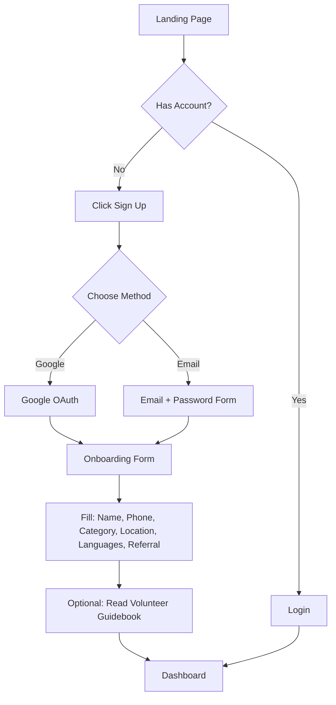
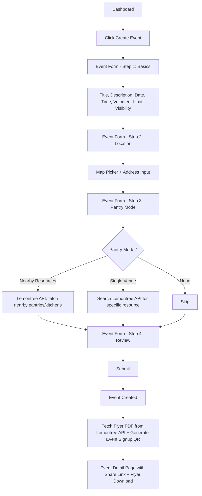
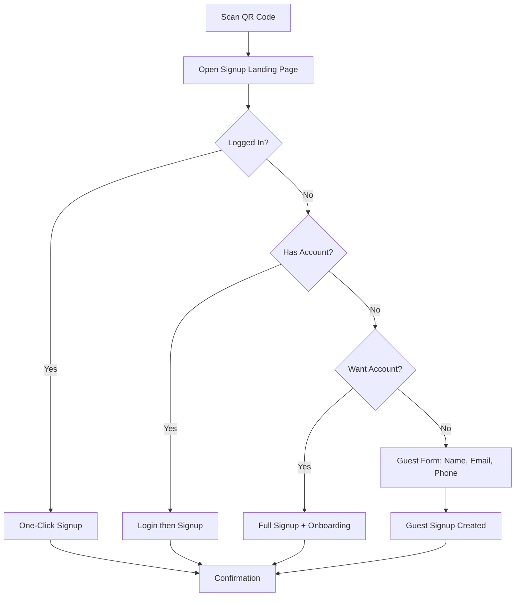
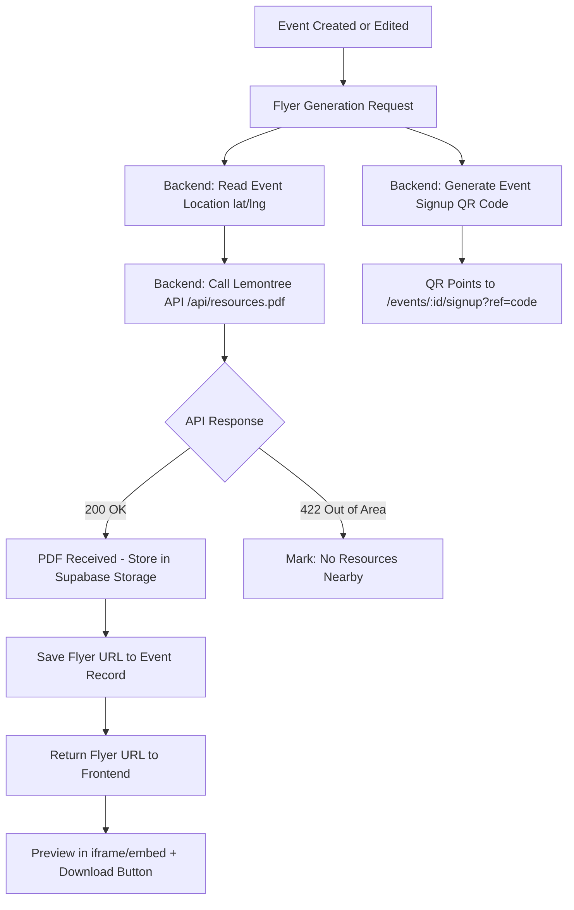
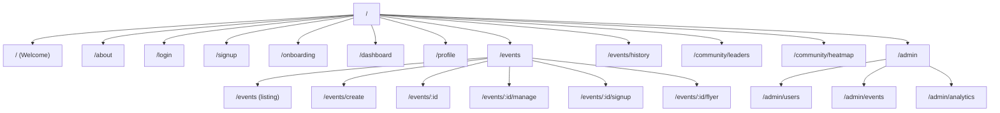
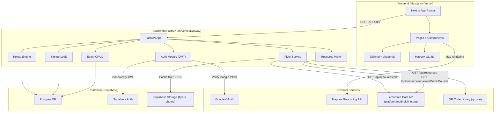

# Lemontree Volunteer Outreach Platform -- Build Plan

---

## 1. Product Summary

**Problem:** Lemontree is a nonprofit that relies on volunteers to flyer communities about local food pantries. Currently, every flyering event requires manual staff coordination -- scheduling, volunteer communication, flyer creation, and follow-up. This does not scale.

**Users:**

- **Event Leaders** -- volunteers who organize and run flyering events
- **Event Participants** -- volunteers who join events
- **Event Promoters** -- volunteers who share/promote events and recruit others
- **Lemontree Admins** -- staff with lightweight oversight and analytics

**Product Goal:** A self-serve platform where volunteers can create flyering events, pull branded flyers from the Lemontree Data API (with nearby food resource info and QR codes), recruit other volunteers, and track collective impact -- all with minimal Lemontree staff involvement.

**MVP vs Later-Phase Split:**


| Category             | MVP (Phases 0-5)                            | Later (Phases 6-7+)                  |
| -------------------- | ------------------------------------------- | ------------------------------------ |
| Auth + Onboarding    | Google OAuth, email/password, profile       | SSO, advanced referral tracking      |
| Event CRUD           | Full create/edit/delete, signup, share link | Mass messaging, team clustering      |
| Flyer Generation     | Lemontree API PDF with nearby resources + QR | Multi-template editor, custom layouts |
| Dashboard            | My events, upcoming, event history          | Advanced analytics                   |
| Points + Leaderboard | --                                          | Points system, leaderboard           |
| Heatmap              | --                                          | Geographic coverage heatmap          |
| Post-Event           | Basic photo upload                          | Automated appreciation, surveys      |


---

## 2. Assumptions and Open Questions

**Assumptions (labeled):**

- **[A1]** Google OAuth is the primary login; email/password is secondary. No phone-based OTP for MVP.
- **[A2]** Flyer generation uses the **Lemontree Data API** (`GET /api/resources.pdf`) which returns a branded PDF listing up to 4 nearby food resources with a QR code linking to foodhelpline.org. No custom template rendering needed for MVP.
- **[A3]** "Pantry mode" means the event targets food pantry/soup kitchen locations. The **Lemontree Data API** (`GET /api/resources`) provides live food resource data (pantries, soup kitchens) with location, schedules, and contact info. No static seed data needed.
- **[A4]** Guest signup (no account) captures name + email + phone only. Guests can later convert to full accounts.
- **[A5]** Points system is post-MVP. MVP tracks attendance only.
- **[A6]** Heatmap is post-MVP. MVP stores lat/lng on events which enables later heatmap derivation.
- **[A7]** SMS/email notifications are out of MVP scope; in-app messaging only for event leaders.
- **[A8]** Flyer customization for MVP is limited to language (`en` / `es`) and location name -- both supported by the Lemontree API's `flyerLang` and `locationName` parameters.
- **[A9]** "Community Leaders" page is a public leaderboard of top event leaders by events organized / volunteers mobilized.
- **[A10]** The Lemontree Data API is public, requires no auth, and is CORS-enabled. Responses use `superjson` serialization (see Section 9.5 for details). The API is internal and may change without notice.
- **[A11]** There are two distinct "documents" per event: (1) **Resource Flyer** -- the PDF volunteers distribute to community members (generated via Lemontree API), and (2) **Event Signup QR/Link** -- the shareable link/QR for recruiting other volunteers to the event.

**Open Questions (need product owner input):**

- **[Q1]** What exactly does "Event Promoter" do differently from a Participant? Is it a formal role or just someone who shares the link? **Recommendation:** Treat Promoter as an optional tag on any user, not a separate role. Track referrals via share links.
- **[Q2]** Should private events be invite-only or password-protected? **Recommendation:** Invite-only via shareable link. Not listed publicly.
- **[Q3]** ~~Is there a food pantry database we can seed, or do we need to integrate an external API?~~ **RESOLVED:** The Lemontree Data API (`platform.foodhelpline.org`) provides live food resource data. Use `GET /api/resources?lat=X&lng=Y` for nearby pantries and `GET /api/resources/markersWithinBounds` for map markers. No seeding required.
- **[Q4]** ~~What flyer template(s) does Lemontree currently use?~~ **RESOLVED:** The Lemontree API generates flyers via `GET /api/resources.pdf`. Supports English/Spanish (`flyerLang`), location name, referral tracking (`ref`), and sample previews (`sample=1..4`). Use this directly.
- **[Q5]** Should the volunteer guidebook be in-app content or a downloadable PDF? **Recommendation:** Static in-app page for MVP, downloadable PDF later.
- **[Q6]** Is there a cap on events a single leader can create? **Recommendation:** No cap for MVP, add rate limiting if abused.

---

## 3. MVP Definition

### Must-Have (ship-blocking)

- Google OAuth + email/password signup/login
- Volunteer onboarding form (name, phone, email, role, category, location, languages, referral)
- Event creation with all specified fields (title, description, leader, date/time, location with map, volunteer limit, public/private, pantry mode via Lemontree API, shareable link)
- Event listing (upcoming events, public feed)
- Event signup (authenticated + guest)
- QR code generation on event detail page (links to volunteer signup)
- Flyer generation via Lemontree Data API (`/api/resources.pdf`) showing nearby food resources + QR to foodhelpline.org
- Event detail page with signup list
- Dashboard (my events, events I joined)
- Profile page (view + edit)

### Should-Have (strongly desired)

- Event editing by leader
- Event history (past events)
- Post-event photo upload
- Map-based location picker (Mapbox) with nearby resources overlay (via Lemontree API)
- Shareable event link with OG meta tags
- Guest-to-account conversion flow
- Basic event lifecycle states (upcoming / active / completed)

### Nice-to-Have (defer if tight)

- Points system + leaderboard
- Heatmap
- Mass messaging
- Team clustering
- Automated post-event appreciation
- Badges / certifications
- Community Leaders page with rankings
- PWA support

---

## 4. User Roles and Permissions

```
Role              | Create Event | Edit Event  | Delete Event | View Events | Join Event | Manage Signups | View Dashboard | View All Events | Manage Users | Generate Flyer | Upload Photos
------------------|-------------|-------------|-------------|-------------|-----------|---------------|---------------|----------------|-------------|---------------|-------------
Event Leader      | Yes         | Own only    | Own only    | All public  | Yes       | Own events    | Own events    | Public         | No          | Own events    | Own events
Event Participant | No          | No          | No          | All public  | Yes       | No            | Joined events | Public         | No          | No            | Own attendance
Event Promoter*   | No          | No          | No          | All public  | Yes       | No            | Shared events | Public         | No          | No            | No
Admin             | Yes         | All         | All         | All         | Yes       | All           | All           | All            | Yes         | All           | All
```

*Promoter is an optional tag, not a separate auth role. Any user can share an event link. Referral tracking attributes signups to the sharer.

**Implementation:** Store `role` as an enum on the user: `volunteer | admin`. Track `is_event_leader` dynamically (any user who creates an event becomes leader of that event). Promoter tracking via `referral_code` on share links.

---

## 5. Core User Flows

### Flow 1: New Volunteer Onboarding




**Steps:**

1. User lands on welcome page, clicks "Get Started"
2. Chooses Google OAuth or email/password signup
3. After auth, redirected to onboarding form (multi-step or single page)
4. Fills in: name, phone, category, location, languages spoken, how they found Lemontree, referral code (optional)
5. Optional: views volunteer guidebook / conversation tips
6. Redirected to dashboard

### Flow 2: Event Creation




**Steps:**

1. Authenticated user clicks "Create Event" from dashboard
2. Multi-step form: Basics -> Location -> Nearby Resources -> Review
3. Location step uses Mapbox for geocoding + map pin
4. Nearby Resources step queries Lemontree Data API (`GET /api/resources?lat=X&lng=Y`) to show nearby food pantries/soup kitchens
5. On submit: event created, shareable volunteer signup link generated, resource flyer fetched from Lemontree API (`GET /api/resources.pdf`)
6. User sees event detail page with resource flyer preview, event signup QR code, share link

### Flow 3: Event Signup via QR Code




**Steps:**

1. Person scans QR code on flyer -> opens `/events/{event_id}/signup?ref={referral_code}`
2. If logged in: one-click signup, done
3. If not logged in: option to login, create account, or continue as guest
4. Guest flow: minimal form (name, email, phone), no password needed
5. Confirmation page with event details and "add to calendar" link

### Flow 4: Flyer Generation (via Lemontree Data API)



**Two outputs per event:**

1. **Resource Flyer (from Lemontree API):** The PDF volunteers distribute to community members, listing up to 4 nearby food resources with a QR code to foodhelpline.org
2. **Event Signup QR/Link:** A separate QR code and shareable link for recruiting other volunteers to the event

**Steps:**

1. Triggered on event creation or when leader requests regeneration
2. Backend calls `GET https://platform.foodhelpline.org/api/resources.pdf?lat={event.lat}&lng={event.lng}&locationName={event.location_name}&flyerLang={event.flyer_language}&ref={event.id}`
3. If 200: PDF stream saved to Supabase Storage bucket `flyers/{event_id}/`; URL saved to `events.flyer_url`
4. If 422 (out of service area): event marked as having no nearby resources; leader notified
5. Separately, backend generates event signup QR code using Python `qrcode` library (pointing to `{domain}/events/{id}/signup`)
6. Frontend displays: resource flyer preview (iframe/embed), flyer download button, event signup QR code, and shareable volunteer signup link

### Flow 5: Event Management by Leader

**Steps:**

1. Leader views event from dashboard -> event detail/management page
2. Sees: signup count, attendee list, event status
3. Can: edit event details, view/download flyer, copy share link
4. Pre-event: send message to all signups (in-app notification)
5. Post-event: mark attendance (attended / no-show), upload photos, trigger appreciation message
6. Event auto-transitions: upcoming -> active (on date) -> completed (after end time)

### Flow 6: Post-Event Wrap-Up

**Steps:**

1. After event end time, status transitions to "completed"
2. Leader can mark each signup as attended / no-show / cancelled
3. Leader uploads event photos (stored in Supabase Storage)
4. System sends appreciation notification to attendees (in-app for MVP)
5. Points awarded based on attendance (post-MVP)

### Flow 7: Points / Impact Tracking (Post-MVP)

**Steps:**

1. Points awarded for: creating event (+50), attending event (+20), referring volunteer (+30), uploading photos (+10)
2. Points stored in `point_transactions` table
3. User profile shows total points + breakdown
4. Leaderboard page shows top volunteers by points

### Flow 8: Heatmap (Post-MVP)

**Steps:**

1. Events with lat/lng stored in DB
2. Heatmap aggregation job groups events by geographic grid cells
3. Frontend renders heatmap layer on Mapbox map
4. Color intensity = event density. Sparse areas highlighted to motivate coverage.

---

## 6. Information Architecture

### Route Tree




### Public Routes (no auth required)

- `/` -- Welcome/landing page
- `/about` -- About Lemontree
- `/login` -- Login
- `/signup` -- Signup
- `/events/:id/signup` -- Event signup landing (QR code destination)
- `/community/leaders` -- Public leaderboard
- `/community/heatmap` -- Public heatmap

### Authenticated Routes

- `/onboarding` -- Post-signup onboarding form
- `/dashboard` -- Main dashboard
- `/profile` -- User profile (view + edit)
- `/events` -- Browse upcoming public events
- `/events/create` -- Create new event
- `/events/:id` -- Event detail
- `/events/:id/manage` -- Event management (leader only)
- `/events/:id/flyer` -- Flyer preview/edit (leader only)
- `/events/history` -- Past events

### Admin Routes

- `/admin` -- Admin dashboard
- `/admin/users` -- User management
- `/admin/events` -- All events oversight
- `/admin/analytics` -- Platform analytics

---

## 7. Detailed Page-by-Page Requirements

### 7.1 Welcome Page (`/`)

- **Purpose:** Convert visitors into volunteers
- **Primary Users:** New visitors, potential volunteers
- **UI Sections:**
  - Hero with tagline + CTA ("Get Started" / "Join as Volunteer")
  - Mission statement / what Lemontree does
  - How it works (3-step: Sign up -> Create/Join Event -> Make Impact)
  - Social proof (volunteer count, events hosted, areas covered)
  - Footer with links
- **Components:** Hero, StepCard, StatsBar, CTAButton
- **Data:** Aggregate stats (total volunteers, events, etc.) -- can be static for MVP
- **Actions:** Navigate to signup, navigate to about, browse events
- **Edge States:** None significant

### 7.2 About Page (`/about`)

- **Purpose:** Explain Lemontree's mission, include volunteer guidebook content
- **Primary Users:** Prospective volunteers
- **UI Sections:**
  - Mission and story
  - Volunteer guidebook (conversation tips, icebreakers)
  - Team / leadership
  - Contact info
- **Components:** ContentSection, AccordionFAQ, TeamGrid
- **Data:** Static content (MDX or hardcoded)
- **Actions:** Navigate to signup
- **Edge States:** None

### 7.3 Login / Signup (`/login`, `/signup`)

- **Purpose:** Authenticate users
- **Primary Users:** All
- **UI Sections:**
  - Google OAuth button (prominent)
  - Email + password form
  - Toggle between login/signup
  - "Forgot password" link
- **Components:** AuthForm, GoogleOAuthButton, InputField, PasswordField
- **Data:** None pre-loaded
- **Actions:** Login, signup, OAuth redirect, forgot password
- **Edge States:** Invalid credentials, email already exists, OAuth failure, network error

### 7.4 Onboarding (`/onboarding`)

- **Purpose:** Collect volunteer profile information after first signup
- **Primary Users:** New users
- **UI Sections:**
  - Progress indicator (step 1/2/3)
  - Step 1: Personal info (name, phone, category, location)
  - Step 2: Languages, referral, how they found Lemontree
  - Step 3: Welcome message + optional guidebook
- **Components:** MultiStepForm, LocationPicker, MultiSelect (languages), RadioGroup (category)
- **Data:** None pre-loaded
- **Actions:** Submit profile, skip optional fields, complete onboarding
- **Edge States:** Incomplete required fields, location service denied

### 7.5 Dashboard (`/dashboard`)

- **Purpose:** Central hub for volunteer activity
- **Primary Users:** All authenticated users
- **UI Sections:**
  - Welcome banner with user name + quick stats
  - "My Upcoming Events" (created + joined)
  - "Quick Actions" (Create Event, Browse Events, View Profile)
  - Recent activity feed (optional for MVP)
  - Impact summary (events attended, hours contributed) -- placeholder for MVP
- **Components:** EventCard, StatsWidget, QuickActionCard, ActivityFeed
- **Data:** User's events (created + signed up), user stats
- **Actions:** Create event, view event, browse events
- **Edge States:** No events yet (empty state with CTA), loading state

### 7.6 Profile (`/profile`)

- **Purpose:** View and edit personal information
- **Primary Users:** All authenticated users
- **UI Sections:**
  - Profile header (avatar, name, role, category)
  - Editable fields (all onboarding fields)
  - Stats summary (events created, attended, points)
  - Event history summary
- **Components:** ProfileHeader, EditableField, StatsGrid
- **Data:** User record, aggregated stats
- **Actions:** Edit profile, save changes
- **Edge States:** Save failure, unsaved changes warning

### 7.7 Upcoming Events (`/events`)

- **Purpose:** Browse and discover public events
- **Primary Users:** All authenticated users
- **UI Sections:**
  - Search bar + filters (date, location, category)
  - Map view toggle (show events on map)
  - Event cards grid/list
  - Pagination
- **Components:** EventCard, SearchBar, FilterPanel, MapView, Pagination
- **Data:** Public events list (paginated), user's signup status per event
- **Actions:** Search, filter, view event detail, signup
- **Edge States:** No events found, no events in area, loading

### 7.8 Event History (`/events/history`)

- **Purpose:** View past events the user participated in or led
- **Primary Users:** All authenticated users
- **UI Sections:**
  - Filter: "Events I Led" / "Events I Joined" / "All"
  - Event cards with completion status
  - Impact summary per event (volunteers attended, photos)
- **Components:** EventCard (past variant), FilterTabs, ImpactSummary
- **Data:** User's past events with attendance data
- **Actions:** View event detail, view photos
- **Edge States:** No past events

### 7.9 Event Creation (`/events/create`)

- **Purpose:** Create a new flyering event (PRIORITY #1 page)
- **Primary Users:** Event Leaders
- **UI Sections:**
  - Multi-step form with progress bar
  - Step 1 -- Basics: Title, description, date/time pickers, volunteer limit, public/private toggle
  - Step 2 -- Location: Mapbox map with pin drop, address autocomplete, location name
  - Step 3 -- Nearby Resources: Toggle (none / show nearby resources), live preview of nearby food pantries/soup kitchens fetched from Lemontree Data API (`GET /api/resources?lat=X&lng=Y&take=5`), optional resource selection
  - Step 4 -- Review: Summary of all fields, flyer language selector (`en` / `es`), sample flyer preview (via `GET /api/resources.pdf?sample=1`), submit
- **Components:** MultiStepForm, DateTimePicker, MapboxLocationPicker, ResourceSelector, VolunteerLimitInput, VisibilityToggle, ReviewSummary, FlyerLanguagePicker
- **Data:** Nearby resources from Lemontree Data API (live query), Mapbox geocoding API
- **Actions:** Navigate steps, preview nearby resources, preview sample flyer, submit event, save draft (nice-to-have)
- **Edge States:** Validation errors per step, Mapbox API failure, Lemontree API failure/timeout, no resources in area (422), duplicate event warning

### 7.10 Event Detail / Management (`/events/:id`, `/events/:id/manage`)

- **Purpose:** View event info (public), manage event (leader)
- **Primary Users:** All users (detail), Event Leaders (manage)
- **UI Sections (Detail):**
  - Event header (title, date, location, leader)
  - Map showing event location + nearby food resources (markers from Lemontree API)
  - Description
  - Signup count / volunteer limit progress bar
  - Signup button (or "Already signed up" state)
  - Volunteer share link + event signup QR code
  - Resource flyer download button (PDF from Lemontree API)
- **UI Sections (Manage -- leader only):**
  - All detail sections plus:
  - Attendee list with check-in status
  - Edit event button
  - Message volunteers button
  - Post-event: mark attendance, upload photos
  - Regenerate flyer button
- **Components:** EventHeader, MapEmbed, SignupButton, AttendeeList, CheckInToggle, PhotoUploader, MessageComposer, ResourceCard, FlyerPreview, QRCodeDisplay
- **Data:** Event record, signups list, flyer URL (from Supabase Storage), nearby resources (from Lemontree API), user's signup status
- **Actions:** Signup, cancel signup, edit event, message volunteers, mark attendance, upload photos, download flyer
- **Edge States:** Event full, event passed, event cancelled, not authorized to manage

### 7.11 Event Signup Landing (`/events/:id/signup`)

- **Purpose:** QR code destination for flyered people to sign up
- **Primary Users:** General public (scanned QR code)
- **UI Sections:**
  - Event summary (title, date, location, description)
  - Signup options: Login, Create Account, Continue as Guest
  - Guest form: Name, Email, Phone
  - Confirmation message after signup
- **Components:** EventSummaryCard, GuestSignupForm, AuthPrompt, ConfirmationMessage
- **Data:** Public event info
- **Actions:** Guest signup, login redirect, account creation redirect
- **Edge States:** Event full, event passed, invalid event ID, already signed up

### 7.12 Flyer Preview / Edit (`/events/:id/flyer`)

- **Purpose:** Preview, customize, and download the resource flyer + event signup QR
- **Primary Users:** Event Leaders
- **UI Sections:**
  - **Resource Flyer section:**
    - Flyer preview (iframe/embed of PDF from Lemontree API or cached Supabase Storage URL)
    - Language selector (`en` / `es`) -- triggers re-fetch from `GET /api/resources.pdf?flyerLang=X`
    - Location name override input (passed as `locationName` param)
    - Download PDF button
    - Regenerate button (re-fetches from Lemontree API with current params)
    - Sample flyer toggle for preview (`sample=1..4`)
  - **Event Signup QR section:**
    - QR code display (encodes `{domain}/events/{id}/signup?ref={referral_code}`)
    - Copy shareable link button
    - QR download button (PNG)
  - **Nearby Resources preview:**
    - List of up to 4 resources included in the flyer (fetched from `GET /api/resources?lat=X&lng=Y&take=4`)
    - Each shows: name, address, next occurrence, resource type (pantry/soup kitchen)
- **Components:** FlyerPreview, LanguageSelector, DownloadButton, QRCodeDisplay, ResourceCard, LocationNameInput
- **Data:** Event record, Lemontree API flyer PDF URL, nearby resources from API, generated event signup QR
- **Actions:** Change language, change location name, regenerate flyer, download PDF, copy share link, download QR
- **Edge States:** Flyer generation in progress (loading), API returns 422 (no resources in area -- show message with option to try different coordinates), API timeout

### 7.13 Community Leaders (`/community/leaders`)

- **Purpose:** Public leaderboard showcasing top volunteers
- **Primary Users:** All users (public)
- **UI Sections:**
  - Leaderboard table/cards (rank, name, events led, volunteers mobilized, points)
  - Time filter (all-time, this month, this week)
  - Category filter (by region, by category)
- **Components:** LeaderboardTable, LeaderCard, TimeFilter
- **Data:** Aggregated leaderboard data
- **Actions:** Filter, view leader profile
- **Edge States:** No data yet, loading

---

## 8. Data Model Design

### 8.1 `users`


| Column               | Type                                                               | Required | Notes                                     |
| -------------------- | ------------------------------------------------------------------ | -------- | ----------------------------------------- |
| id                   | UUID (PK)                                                          | Yes      | Default: `gen_random_uuid()`              |
| email                | VARCHAR(255)                                                       | Yes      | Unique, indexed                           |
| password_hash        | VARCHAR(255)                                                       | No       | Null for OAuth-only users                 |
| name                 | VARCHAR(255)                                                       | Yes      |                                           |
| phone                | VARCHAR(20)                                                        | No       |                                           |
| avatar_url           | TEXT                                                               | No       |                                           |
| role                 | ENUM('volunteer','admin')                                          | Yes      | Default: 'volunteer'                      |
| category             | ENUM('corporate','leadership_group','student','community','other') | No       |                                           |
| location_name        | VARCHAR(255)                                                       | No       | Human-readable location                   |
| latitude             | DECIMAL(10,8)                                                      | No       |                                           |
| longitude            | DECIMAL(11,8)                                                      | No       |                                           |
| languages            | TEXT[]                                                             | No       | Postgres array                            |
| referral_source      | VARCHAR(255)                                                       | No       | How they found Lemontree                  |
| referred_by_user_id  | UUID (FK -> users)                                                 | No       |                                           |
| referral_code        | VARCHAR(20)                                                        | Yes      | Unique, auto-generated for share tracking |
| onboarding_completed | BOOLEAN                                                            | Yes      | Default: false                            |
| total_points         | INTEGER                                                            | Yes      | Default: 0, denormalized for perf         |
| auth_provider        | ENUM('email','google')                                             | Yes      |                                           |
| created_at           | TIMESTAMPTZ                                                        | Yes      | Default: now()                            |
| updated_at           | TIMESTAMPTZ                                                        | Yes      | Auto-update trigger                       |


**Indexes:** `email` (unique), `referral_code` (unique), `location` (lat/lng for geo queries), `total_points` (for leaderboard)

### 8.2 `events`


| Column               | Type                                                      | Required | Notes                      |
| -------------------- | --------------------------------------------------------- | -------- | -------------------------- |
| id                   | UUID (PK)                                                 | Yes      |                            |
| title                | VARCHAR(255)                                              | Yes      |                            |
| description          | TEXT                                                      | No       |                            |
| event_leader_id      | UUID (FK -> users)                                        | Yes      | Indexed                    |
| visibility           | ENUM('public','private')                                  | Yes      | Default: 'public'          |
| status               | ENUM('draft','upcoming','active','completed','cancelled') | Yes      | Default: 'upcoming'        |
| date                 | DATE                                                      | Yes      | Indexed                    |
| start_time           | TIMESTAMPTZ                                               | Yes      |                            |
| end_time             | TIMESTAMPTZ                                               | Yes      |                            |
| location_name        | VARCHAR(255)                                              | Yes      |                            |
| latitude             | DECIMAL(10,8)                                             | Yes      |                            |
| longitude            | DECIMAL(11,8)                                             | Yes      |                            |
| volunteer_limit      | INTEGER                                                   | No       | Null = unlimited           |
| current_signup_count | INTEGER                                                   | Yes      | Default: 0, denormalized   |
| pantry_mode          | ENUM('none','nearby_resources','single_resource')         | Yes      | Default: 'none'            |
| resource_count       | INTEGER                                                   | No       | For nearby_resources mode  |
| resource_id          | VARCHAR(255)                                              | No       | Lemontree API resource ID for single_resource mode |
| flyer_language       | VARCHAR(10)                                               | Yes      | Default: 'en'              |
| flyer_url            | TEXT                                                      | No       | URL to generated flyer PDF |
| shareable_link       | VARCHAR(255)                                              | Yes      | Unique short link or slug  |
| created_at           | TIMESTAMPTZ                                               | Yes      |                            |
| updated_at           | TIMESTAMPTZ                                               | Yes      |                            |


**Indexes:** `event_leader_id`, `date`, `status`, `(latitude, longitude)` (for geo queries), `shareable_link` (unique)

### 8.3 `event_signups`


| Column           | Type                                                | Required | Notes                         |
| ---------------- | --------------------------------------------------- | -------- | ----------------------------- |
| id               | UUID (PK)                                           | Yes      |                               |
| event_id         | UUID (FK -> events)                                 | Yes      |                               |
| user_id          | UUID (FK -> users)                                  | No       | Null for guest signups        |
| guest_signup_id  | UUID (FK -> guest_signups)                          | No       |                               |
| status           | ENUM('registered','attended','cancelled','no_show') | Yes      | Default: 'registered'         |
| referred_by_code | VARCHAR(20)                                         | No       | Referral code from share link |
| signed_up_at     | TIMESTAMPTZ                                         | Yes      |                               |
| checked_in_at    | TIMESTAMPTZ                                         | No       |                               |


**Indexes:** `(event_id, user_id)` unique, `(event_id, guest_signup_id)` unique, `event_id`
**Constraint:** Either `user_id` or `guest_signup_id` must be non-null (CHECK constraint)

### 8.4 `guest_signups`


| Column               | Type               | Required | Notes                          |
| -------------------- | ------------------ | -------- | ------------------------------ |
| id                   | UUID (PK)          | Yes      |                                |
| name                 | VARCHAR(255)       | Yes      |                                |
| email                | VARCHAR(255)       | Yes      |                                |
| phone                | VARCHAR(20)        | No       |                                |
| converted_to_user_id | UUID (FK -> users) | No       | Set when guest creates account |
| created_at           | TIMESTAMPTZ        | Yes      |                                |


**Indexes:** `email`, `converted_to_user_id`

### 8.5 `resource_cache` (optional -- Lemontree API data cache)

> **Note:** The primary source of truth for food resource data is the Lemontree Data API (`platform.foodhelpline.org`). This table is an optional cache to reduce API calls and provide offline resilience. For MVP, querying the API directly is acceptable.


| Column           | Type                                 | Required | Notes                                                    |
| ---------------- | ------------------------------------ | -------- | -------------------------------------------------------- |
| id               | VARCHAR(255) (PK)                    | Yes      | Lemontree API resource ID (e.g., `clxyz123`)             |
| name             | VARCHAR(255)                         | No       |                                                          |
| description      | TEXT                                 | No       |                                                          |
| resource_type    | ENUM('FOOD_PANTRY','SOUP_KITCHEN')   | Yes      |                                                          |
| address_street   | TEXT                                 | No       |                                                          |
| city             | VARCHAR(255)                         | No       |                                                          |
| state            | VARCHAR(10)                          | No       |                                                          |
| zip_code         | VARCHAR(10)                          | No       |                                                          |
| latitude         | DECIMAL(10,8)                        | No       |                                                          |
| longitude        | DECIMAL(11,8)                        | No       |                                                          |
| phone            | VARCHAR(20)                          | No       | From `contacts[0].phone`                                 |
| resource_status  | VARCHAR(20)                          | No       | PUBLISHED, UNPUBLISHED, REMOVED                          |
| confidence       | DECIMAL(3,2)                         | No       | 0-1 data quality score from API                          |
| raw_json         | JSONB                                | No       | Full API response for this resource                      |
| cached_at        | TIMESTAMPTZ                          | Yes      |                                                          |
| expires_at       | TIMESTAMPTZ                          | Yes      | Cache TTL (recommend 24h)                                |


**Indexes:** `(latitude, longitude)` for geo queries, `resource_type`, `zip_code`

### 8.6 `point_transactions` (Post-MVP)


| Column      | Type                                                                                             | Required | Notes |
| ----------- | ------------------------------------------------------------------------------------------------ | -------- | ----- |
| id          | UUID (PK)                                                                                        | Yes      |       |
| user_id     | UUID (FK -> users)                                                                               | Yes      |       |
| event_id    | UUID (FK -> events)                                                                              | No       |       |
| action      | ENUM('event_created','event_attended','volunteer_referred','photo_uploaded','flyer_distributed') | Yes      |       |
| points      | INTEGER                                                                                          | Yes      |       |
| description | VARCHAR(255)                                                                                     | No       |       |
| created_at  | TIMESTAMPTZ                                                                                      | Yes      |       |


**Indexes:** `user_id`, `(user_id, created_at)` for history

### 8.7 `event_messages`


| Column       | Type                                           | Required | Notes |
| ------------ | ---------------------------------------------- | -------- | ----- |
| id           | UUID (PK)                                      | Yes      |       |
| event_id     | UUID (FK -> events)                            | Yes      |       |
| sender_id    | UUID (FK -> users)                             | Yes      |       |
| message_type | ENUM('announcement','reminder','appreciation') | Yes      |       |
| content      | TEXT                                           | Yes      |       |
| sent_at      | TIMESTAMPTZ                                    | Yes      |       |


**Indexes:** `event_id`

### 8.8 `event_photos`


| Column      | Type                | Required | Notes                |
| ----------- | ------------------- | -------- | -------------------- |
| id          | UUID (PK)           | Yes      |                      |
| event_id    | UUID (FK -> events) | Yes      |                      |
| uploaded_by | UUID (FK -> users)  | Yes      |                      |
| photo_url   | TEXT                | Yes      | Supabase Storage URL |
| caption     | VARCHAR(255)        | No       |                      |
| uploaded_at | TIMESTAMPTZ         | Yes      |                      |


**Indexes:** `event_id`

### 8.9 `flyer_generations`


| Column       | Type                | Required | Notes                 |
| ------------ | ------------------- | -------- | --------------------- |
| id           | UUID (PK)           | Yes      |                       |
| event_id     | UUID (FK -> events) | Yes      |                       |
| generated_by | UUID (FK -> users)  | Yes      |                       |
| template_id  | VARCHAR(50)         | Yes      | Template name/version |
| language     | VARCHAR(10)         | Yes      |                       |
| file_url     | TEXT                | Yes      |                       |
| generated_at | TIMESTAMPTZ         | Yes      |                       |


**Indexes:** `event_id`

### 8.10 `audit_logs`


| Column        | Type               | Required | Notes                                 |
| ------------- | ------------------ | -------- | ------------------------------------- |
| id            | UUID (PK)          | Yes      |                                       |
| user_id       | UUID (FK -> users) | No       |                                       |
| action        | VARCHAR(100)       | Yes      | e.g., 'event.created', 'user.updated' |
| resource_type | VARCHAR(50)        | Yes      | e.g., 'event', 'user'                 |
| resource_id   | UUID               | No       |                                       |
| metadata      | JSONB              | No       | Additional context                    |
| ip_address    | INET               | No       |                                       |
| created_at    | TIMESTAMPTZ        | Yes      |                                       |


**Indexes:** `user_id`, `action`, `created_at`

---

## 9. API Design

### Auth Endpoints


| Method | Route                       | Purpose        | Auth | Request                   | Response                              |
| ------ | --------------------------- | -------------- | ---- | ------------------------- | ------------------------------------- |
| POST   | `/api/auth/signup`          | Email signup   | No   | `{email, password, name}` | `{user, access_token, refresh_token}` |
| POST   | `/api/auth/login`           | Email login    | No   | `{email, password}`       | `{user, access_token, refresh_token}` |
| POST   | `/api/auth/google`          | Google OAuth   | No   | `{google_token}`          | `{user, access_token, refresh_token}` |
| POST   | `/api/auth/refresh`         | Refresh token  | No   | `{refresh_token}`         | `{access_token, refresh_token}`       |
| POST   | `/api/auth/logout`          | Logout         | Yes  | --                        | `{success}`                           |
| POST   | `/api/auth/forgot-password` | Password reset | No   | `{email}`                 | `{success}`                           |


### User Endpoints


| Method | Route                      | Purpose                   | Auth | Request                                            | Response                                         |
| ------ | -------------------------- | ------------------------- | ---- | -------------------------------------------------- | ------------------------------------------------ |
| GET    | `/api/users/me`            | Get current user          | Yes  | --                                                 | `{user}`                                         |
| PUT    | `/api/users/me`            | Update profile            | Yes  | `{name, phone, ...}`                               | `{user}`                                         |
| PUT    | `/api/users/me/onboarding` | Complete onboarding       | Yes  | `{category, location, languages, referral_source}` | `{user}`                                         |
| GET    | `/api/users/:id`           | Get user profile (public) | No   | --                                                 | `{user_public}`                                  |
| GET    | `/api/users/me/stats`      | Get user stats            | Yes  | --                                                 | `{events_created, events_attended, points, ...}` |


### Event Endpoints


| Method | Route                             | Purpose                 | Auth         | Request                                                                                                                                                              | Response                                         |
| ------ | --------------------------------- | ----------------------- | ------------ | -------------------------------------------------------------------------------------------------------------------------------------------------------------------- | ------------------------------------------------ |
| POST   | `/api/events`                     | Create event            | Yes          | `{title, description, date, start_time, end_time, location_name, lat, lng, volunteer_limit, visibility, pantry_mode, pantry_count, pantry_venue_id, flyer_language}` | `{event}`                                        |
| GET    | `/api/events`                     | List public events      | No           | Query: `?page, limit, date_from, date_to, lat, lng, radius, status`                                                                                                  | `{events[], total, page}`                        |
| GET    | `/api/events/:id`                 | Get event detail        | No*          | --                                                                                                                                                                   | `{event, signup_count, is_signed_up, flyer_url}` |
| PUT    | `/api/events/:id`                 | Update event            | Yes (leader) | `{...fields}`                                                                                                                                                        | `{event}`                                        |
| DELETE | `/api/events/:id`                 | Cancel/delete event     | Yes (leader) | --                                                                                                                                                                   | `{success}`                                      |
| GET    | `/api/events/my/created`          | My created events       | Yes          | Query: `?status`                                                                                                                                                     | `{events[]}`                                     |
| GET    | `/api/events/my/joined`           | My joined events        | Yes          | Query: `?status`                                                                                                                                                     | `{events[]}`                                     |
| GET    | `/api/events/:id/nearby-resources`| Get resources near event (proxies Lemontree API) | No | Query: `?take, resourceTypeId` | `{resources[], count}` |


*Private events require auth + signup or leader status

### Signup Endpoints


| Method | Route                                | Purpose                          | Auth         | Request                                | Response         |
| ------ | ------------------------------------ | -------------------------------- | ------------ | -------------------------------------- | ---------------- |
| POST   | `/api/events/:id/signup`             | Signup for event (authenticated) | Yes          | `{referral_code?}`                     | `{signup}`       |
| POST   | `/api/events/:id/guest-signup`       | Guest signup                     | No           | `{name, email, phone, referral_code?}` | `{guest_signup}` |
| DELETE | `/api/events/:id/signup`             | Cancel signup                    | Yes          | --                                     | `{success}`      |
| GET    | `/api/events/:id/signups`            | List signups (leader)            | Yes (leader) | --                                     | `{signups[]}`    |
| PUT    | `/api/events/:id/signups/:signup_id` | Update attendance                | Yes (leader) | `{status}`                             | `{signup}`       |


### Flyer Endpoints


| Method | Route                            | Purpose                   | Auth         | Request                     | Response                    |
| ------ | -------------------------------- | ------------------------- | ------------ | --------------------------- | --------------------------- |
| POST   | `/api/events/:id/flyer/generate` | Fetch flyer PDF from Lemontree API and cache in Supabase Storage | Yes (leader) | `{language?, location_name?}` | `{flyer_url, resources_found}` |
| GET    | `/api/events/:id/flyer`          | Get cached flyer info     | No           | --                          | `{flyer_url, generated_at, language, resources_found}` |
| GET    | `/api/events/:id/flyer/preview`  | Stream flyer PDF directly from Lemontree API (no caching) | Yes (leader) | Query: `?language, sample` | `application/pdf` stream |

### Resource Proxy Endpoints (Lemontree Data API)


| Method | Route                              | Purpose                                   | Auth | Request                                         | Response                                     |
| ------ | ---------------------------------- | ----------------------------------------- | ---- | ----------------------------------------------- | -------------------------------------------- |
| GET    | `/api/resources/nearby`            | Proxy: nearby food resources              | No   | Query: `?lat, lng, take, resourceTypeId, text`  | `{resources[], count, cursor}`               |
| GET    | `/api/resources/:id`               | Proxy: single resource detail             | No   | --                                              | `{resource}`                                 |
| GET    | `/api/resources/markers`           | Proxy: map markers in bounding box        | No   | Query: `?sw_lat, sw_lng, ne_lat, ne_lng`        | GeoJSON FeatureCollection                    |
| GET    | `/api/resources/search`            | Proxy: search resources by name or zip    | No   | Query: `?text, location, lat, lng`              | `{resources[], count, cursor}`               |


### Messaging Endpoints


| Method | Route                      | Purpose                    | Auth         | Request                   | Response       |
| ------ | -------------------------- | -------------------------- | ------------ | ------------------------- | -------------- |
| POST   | `/api/events/:id/messages` | Send message to volunteers | Yes (leader) | `{content, message_type}` | `{message}`    |
| GET    | `/api/events/:id/messages` | Get event messages         | Yes (member) | --                        | `{messages[]}` |


### Photo Endpoints


| Method | Route                    | Purpose          | Auth | Request                      | Response     |
| ------ | ------------------------ | ---------------- | ---- | ---------------------------- | ------------ |
| POST   | `/api/events/:id/photos` | Upload photo     | Yes  | multipart: `{file, caption}` | `{photo}`    |
| GET    | `/api/events/:id/photos` | Get event photos | No   | --                           | `{photos[]}` |


### Points + Leaderboard Endpoints (Post-MVP)


| Method | Route              | Purpose         | Auth | Request                           | Response                  |
| ------ | ------------------ | --------------- | ---- | --------------------------------- | ------------------------- |
| GET    | `/api/points/me`   | Get my points   | Yes  | --                                | `{total, transactions[]}` |
| GET    | `/api/leaderboard` | Get leaderboard | No   | Query: `?period, category, limit` | `{leaders[]}`             |


### Heatmap Endpoints (Post-MVP)


| Method | Route          | Purpose                | Auth | Request                      | Response                                |
| ------ | -------------- | ---------------------- | ---- | ---------------------------- | --------------------------------------- |
| GET    | `/api/heatmap` | Get event density data | No   | Query: `?bounds, zoom_level` | `{cells[{lat, lng, count, intensity}]}` |


### Admin Endpoints


| Method | Route                       | Purpose            | Auth        | Request                | Response                           |
| ------ | --------------------------- | ------------------ | ----------- | ---------------------- | ---------------------------------- |
| GET    | `/api/admin/users`          | List all users     | Yes (admin) | Query: `?page, search` | `{users[], total}`                 |
| PUT    | `/api/admin/users/:id/role` | Change user role   | Yes (admin) | `{role}`               | `{user}`                           |
| GET    | `/api/admin/events`         | List all events    | Yes (admin) | Query: `?page, status` | `{events[], total}`                |
| GET    | `/api/admin/analytics`      | Platform analytics | Yes (admin) | --                     | `{total_users, total_events, ...}` |
| DELETE | `/api/admin/events/:id`     | Force delete event | Yes (admin) | --                     | `{success}`                        |


---

## 9.5 Lemontree Data API Integration

> **Base URL:** `https://platform.foodhelpline.org`
> **Auth:** None required (public, CORS-enabled)
> **Response format:** `superjson` -- responses have `{ json: {...}, meta: {...} }` structure. Use `superjson.deserialize(raw)` or access `raw.json` directly.
> **Status as of:** March 12, 2026 (internal API, may change without notice)

### Endpoints Used by This Platform

| Endpoint | Purpose in Our Platform | Key Params |
| --- | --- | --- |
| `GET /api/resources` | Fetch nearby food pantries/soup kitchens for event creation (pantry mode), event detail maps, and resource browsing | `lat`, `lng`, `location` (zip), `text`, `resourceTypeId`, `occurrencesWithin`, `take`, `cursor`, `sort` |
| `GET /api/resources/:id` | Get full details for a single food resource | Resource ID from list endpoint |
| `GET /api/resources/markersWithinBounds` | Lightweight map markers for map views (GeoJSON FeatureCollection) | `corner` (two `lng,lat` pairs for bounding box). Max 1000 results |
| `GET /api/resources.pdf` | **Generate resource flyer PDF** -- the primary flyer volunteers distribute | `lat` (required), `lng` (required), `locationName`, `flyerLang` (`en`/`es`), `ref` (referral tracking), `sample` (`1`-`4` for demo) |

### Resource Data Model (from API)

Key fields available on each resource:

```
Resource {
  id: string
  name: string | null
  description: string | null
  description_es: string | null            // Spanish description
  addressStreet1, addressStreet2, city, state, zipCode
  latitude: number | null
  longitude: number | null
  timezone: string                          // IANA tz, e.g. "America/New_York"
  website: string | null
  resourceType: { id: "FOOD_PANTRY" | "SOUP_KITCHEN", name, name_es }
  resourceStatus: { id: "PUBLISHED" | "UNPUBLISHED" | "REMOVED" }
  contacts: [{ phone, availability: [{ day, startHour, endHour }] }]
  images: [{ url }]
  shifts: Shift[]                           // Recurring RRULE-based schedule rules
  occurrences: Occurrence[]                 // Next 4 upcoming concrete events
  occurrenceSkipRanges: [...]               // Closed date ranges
  tags: [{ id, name, name_es, tagCategoryId }]
  travelSummary?: { distance: number }      // Meters (only when lat/lng provided)
  confidence: number | null                 // 0-1 data quality score
  ratingAverage: number | null              // 1-5 star average
  _count: { reviews, resourceSubscriptions }
  usageLimitCount, usageLimitIntervalCount, usageLimitIntervalUnit
}
```

### Occurrence (concrete upcoming schedule):

```
Occurrence {
  id: string
  startTime: Date
  endTime: Date
  confirmedAt: Date | null      // Non-null = confirmed open
  skippedAt: Date | null        // Non-null = cancelled
  title, description, address, latitude, longitude
  holidays: [{ name, date }]
}
```

### Flyer PDF Behavior (`/api/resources.pdf`)

- Finds up to **4 nearby resources**: up to 1 soup kitchen + up to 3 food pantries, ranked by proximity
- Generates a QR code linking to `foodhelpline.org/locations/<lat>,<lng>` with UTM tracking
- Returns **422** if coordinates are outside the service area (no resources found)
- Returns **400** if lat/lng are missing or invalid
- `ref` param appended to QR URL for attribution tracking -- pass event ID or leader's referral code
- `sample=1..4` returns demo flyers without real data lookup (useful for preview)

### Pagination (cursor-based)

Response includes a `cursor` field (ID of last result). Pass `?cursor=<value>` for the next page. When `cursor` is absent, you're on the last page.

### Integration Patterns

**Event creation (nearby resources):**
```
GET /api/resources?lat={event.lat}&lng={event.lng}&take=5&sort=distance
```

**Map view (markers):**
```
GET /api/resources/markersWithinBounds?corner={sw_lng},{sw_lat}&corner={ne_lng},{ne_lat}
```

**Flyer generation:**
```
GET /api/resources.pdf?lat={event.lat}&lng={event.lng}&locationName={event.location_name}&flyerLang={event.flyer_language}&ref={event.id}
```

**Calendar/schedule view:**
```
GET /api/resources?occurrencesWithin=2026-03-09T00:00:00Z/2026-03-15T23:59:59Z&lat={lat}&lng={lng}
```

**Search by name or zip:**
```
GET /api/resources?text=brooklyn+food
GET /api/resources?location=11201
```

### superjson Deserialization

```typescript
import superjson from "superjson";

const raw = await fetch("https://platform.foodhelpline.org/api/resources?lat=40.7128&lng=-74.0060&take=10")
  .then(r => r.json());

const { count, resources, cursor } = superjson.deserialize(raw);
// resources[0].occurrences[0].startTime is now a real Date object
```

Or skip deserialization and use `raw.json` directly (Date fields are ISO 8601 strings).

---

## 10. System Architecture




### Component Responsibilities

**Frontend (Next.js):**

- Server-side rendering for public pages (SEO for events, landing)
- Client-side interactivity for forms, maps, dashboards
- JWT token management (httpOnly cookies or localStorage)
- Mapbox GL JS for map rendering
- PDF preview via iframe/embed

**Backend (FastAPI):**

- REST API for all business logic
- JWT-based authentication (issue + verify tokens)
- Google OAuth token verification
- Event CRUD with authorization checks
- **Lemontree Data API proxy** -- resource search, nearby resources, map markers
- **Flyer service** -- fetches PDF from Lemontree API (`/api/resources.pdf`), caches in Supabase Storage
- Event signup QR code generation (Python `qrcode` library)
- File upload handling -> Supabase Storage
- Points calculation and attribution
- Heatmap data aggregation

**Database (Supabase Postgres):**

- All relational data storage
- Row Level Security (RLS) as defense-in-depth (primary auth in FastAPI)
- Supabase Auth for Google OAuth provider management
- Supabase Storage for flyers and photos

### Key Flows

**Auth Flow:**

1. User clicks "Sign in with Google" -> frontend gets Google token
2. Frontend sends Google token to `POST /api/auth/google`
3. Backend verifies with Google, creates/finds user, issues JWT
4. JWT stored in httpOnly cookie, sent with every API request

**Flyer Generation Flow (via Lemontree Data API):**

1. Event created -> backend auto-triggers flyer fetch
2. Backend calls `GET https://platform.foodhelpline.org/api/resources.pdf?lat={event.lat}&lng={event.lng}&locationName={event.location_name}&flyerLang={event.flyer_language}&ref={event.id}`
3. If 200: PDF stream saved to Supabase Storage bucket `flyers/{event_id}/flyer-{lang}.pdf`
4. If 422 (out of service area): event flagged, leader notified -- no flyer available
5. Flyer URL saved to `events.flyer_url`
6. Separately: QR code generated pointing to `{domain}/events/{id}/signup` for volunteer recruitment

**QR / Share Link Flow:**

Two distinct QR flows exist:

*Event Signup QR (generated by our platform):*
1. QR code encodes `{domain}/events/{id}/signup?ref={referral_code}`
2. Scanning opens public signup landing page for recruiting volunteers
3. Page shows event info + signup options (login / guest)
4. Guest signup creates `guest_signups` record + `event_signups` record
5. Referral code tracked for points attribution

*Resource Flyer QR (generated by Lemontree API):*
1. QR code on the PDF flyer encodes `foodhelpline.org/locations/{lat},{lng}` with UTM params
2. Community members scan it to find nearby food resources on foodhelpline.org
3. `ref` param passed during flyer generation enables attribution tracking back to the event

**Post-Event Photo Flow:**

1. Leader or attendee uploads photo via event management page
2. Frontend sends multipart form to `POST /api/events/:id/photos`
3. Backend validates auth + event membership
4. File uploaded to Supabase Storage bucket `event-photos/{event_id}/`
5. Record created in `event_photos` table

### Third-Party Integrations


| Service                 | Purpose             | Free Tier         | Notes                        |
| ----------------------- | ------------------- | ----------------- | ---------------------------- |
| Supabase                | DB + Auth + Storage | Yes (generous)    | Primary infrastructure       |
| Mapbox                  | Maps + Geocoding    | 50k loads/mo free | Location picker + event maps |
| Google OAuth            | Authentication      | Free              | Primary login method         |
| **Lemontree Data API**  | **Food resource data + Flyer PDF** | **Free (public)** | **`platform.foodhelpline.org` -- no auth, CORS-enabled. Replaces manual pantry seeding and custom flyer generation** |
| qrcode (Python lib)     | QR code generation  | Free (OSS)        | Event signup QR codes        |
| superjson (npm)         | Lemontree API response parsing | Free (OSS) | Deserializes Date fields from API responses |
| Vercel                  | Frontend hosting    | Free tier         | Next.js deployment           |
| Railway/Render          | Backend hosting     | Free tier         | FastAPI deployment           |


---

## 11. Technical Decisions and Tradeoffs

### Supabase Postgres vs MongoDB

**Decision: Supabase Postgres**

- Volunteer/event data is highly relational (users -> events -> signups -> messages)
- Need JOIN-heavy queries (event with signup count, user with events led/joined)
- Supabase provides auth, storage, and realtime out of the box
- Postgres supports array types (for `languages`), JSONB (for flexible metadata), and PostGIS (for geo queries)
- MongoDB would require more manual relationship management and no built-in auth/storage

### Auth: Supabase Auth vs Custom FastAPI

**Decision: Hybrid -- Supabase Auth for OAuth providers, FastAPI for JWT issuance**

- Use Supabase Auth as the OAuth provider manager (Google sign-in)
- FastAPI issues and verifies its own JWTs for API authentication
- This gives full control over token claims, role-based access, and custom auth logic
- Supabase Auth handles the complexity of OAuth flows and token refresh with providers

### Food Resource Data: Lemontree API vs Seeded Database

**Decision: Lemontree Data API (live) with optional cache table**

- The Lemontree Data API (`platform.foodhelpline.org`) provides live, up-to-date food resource data (pantries, soup kitchens) with location, schedules, contacts, and quality signals
- **Eliminates need to seed and maintain pantry data** -- major simplification
- API is public, CORS-enabled, no auth required
- Responses use `superjson` format -- need to deserialize or access `.json` property
- For MVP: query API directly from backend proxy endpoints. No local caching needed.
- For scale: add `resource_cache` table with 24h TTL to reduce API calls and provide offline resilience
- **Risk:** API is internal and may change without notice. Mitigation: abstract API calls behind a service layer so we can adapt quickly.

### Flyer Generation: Lemontree API vs Custom Pipeline

**Decision: Use Lemontree API's `/api/resources.pdf` endpoint**

- The Lemontree API generates branded flyer PDFs showing nearby food resources with a QR code to foodhelpline.org
- **Eliminates need for weasyprint, custom HTML templates, and PDF rendering** -- massive complexity reduction
- Supports English and Spanish (`flyerLang` param), location names, referral tracking, and sample previews
- Our platform fetches the PDF, caches it in Supabase Storage, and serves it to users
- Event signup QR codes (for volunteer recruitment) are generated separately using Python `qrcode` library
- 422 response when out of service area is handled gracefully (no flyer available for that location)
- For MVP: synchronous fetch on event creation. The API call + storage upload takes <3 seconds.
- **Key insight:** There are two distinct documents -- (1) resource flyer for community members (from API) and (2) event signup QR for volunteer recruitment (generated locally)

### Guest Signups

**Decision: Separate `guest_signups` table linked via `event_signups`**

- Guests get a record in `guest_signups` (name, email, phone only)
- Their `event_signups` record references `guest_signup_id` instead of `user_id`
- When a guest later creates an account with the same email, run a migration to:
  - Set `guest_signups.converted_to_user_id`
  - Update matching `event_signups` to point to the new `user_id`
- This keeps the user table clean and allows frictionless event signup

### Points + Leaderboard: Live vs Pre-Aggregated

**Decision: Pre-aggregated `total_points` on user + transaction log**

- `users.total_points` is denormalized for fast leaderboard queries (`ORDER BY total_points DESC LIMIT 20`)
- `point_transactions` table stores the full log for audit/breakdown
- On point award: INSERT into `point_transactions` + UPDATE `users.total_points` in a transaction
- This avoids expensive `SUM()` queries on every leaderboard load

### Heatmap: Live vs Denormalized

**Decision: Derive from events table for MVP, denormalize later if needed**

- MVP: Query `SELECT latitude, longitude, COUNT(*) FROM events WHERE status='completed' GROUP BY grid_cell` 
- Use server-side grid bucketing (round lat/lng to N decimal places)
- If performance becomes an issue: add `heatmap_aggregates` table refreshed by cron/trigger
- Mapbox GL JS heatmap layer can handle ~10k points client-side

---

## 12. Implementation Roadmap

### Phase 0: Setup / Scaffolding (Day 1 morning)

**Objective:** Project skeleton with all tooling ready
**Deliverables:**

- Next.js app with TypeScript + Tailwind + shadcn/ui initialized
- FastAPI project with folder structure, CORS, health check
- Supabase project created (DB, Auth, Storage buckets)
- GitHub repo with monorepo structure (`/frontend`, `/backend`)
- Environment variables configured
- Basic CI (lint + type check)

**Tasks:**

1. `npx create-next-app` with TypeScript + Tailwind + App Router
2. Install shadcn/ui, configure theme; install `superjson` for Lemontree API response parsing
3. `pip install fastapi uvicorn sqlalchemy alembic httpx` + project structure (`httpx` for Lemontree API calls)
4. Create Supabase project, get connection strings
5. Set up Alembic migrations
6. Create GitHub repo, push skeleton
7. Configure `.env` files for both projects (include `LEMONTREE_API_BASE_URL=https://platform.foodhelpline.org`)
8. Verify Lemontree Data API connectivity: `curl "https://platform.foodhelpline.org/api/resources?take=1"`

**Dependencies:** None
**Risks:** Supabase project creation delay; Mapbox API key procurement; Lemontree API availability (internal, may change)

### Phase 1: Auth + Onboarding (Day 1 afternoon)

**Objective:** Users can sign up, log in, and complete onboarding
**Deliverables:**

- Google OAuth login working end-to-end
- Email/password signup + login
- JWT-based API authentication
- Onboarding form (multi-step)
- User profile page

**Tasks:**

1. Create `users` table migration
2. Implement `/api/auth/signup`, `/api/auth/login`, `/api/auth/google`
3. Implement JWT middleware for FastAPI
4. Build login/signup pages in Next.js
5. Integrate Google OAuth (Supabase Auth or direct)
6. Build onboarding form (multi-step with validation)
7. Build profile page (view + edit)
8. Implement `/api/users/me` endpoints

**Dependencies:** Phase 0
**Risks:** Google OAuth configuration complexity; token refresh edge cases

### Phase 2: Event Creation (Day 1 evening - Day 2 morning) -- PRIORITY

**Objective:** Users can create events with full details including map location and nearby food resources from Lemontree API
**Deliverables:**

- Event creation multi-step form
- Mapbox location picker integration
- Nearby resources display (via Lemontree Data API)
- Event stored in DB with all fields
- Shareable link generated

**Tasks:**

1. Create `events` table migration (no `pantry_locations` table needed -- using Lemontree API)
2. Implement Lemontree API service layer (resource proxy: `GET /api/resources`, `GET /api/resources/:id`, `GET /api/resources/markersWithinBounds`)
3. Implement `/api/events` CRUD endpoints
4. Implement `/api/resources/nearby` proxy endpoint
5. Build event creation form (4-step)
6. Integrate Mapbox GL JS for location picker with Lemontree API markers overlay
7. Implement nearby resources step (fetches live data from Lemontree API based on selected location)
8. Generate shareable link on event creation
9. Build event detail page with nearby resources

**Dependencies:** Phase 1 (auth)
**Risks:** Mapbox integration complexity; Lemontree API availability/latency; API response format changes

### Phase 3: Event Signup + Share Flow (Day 2 midday)

**Objective:** People can sign up for events via shared links and QR codes (volunteer recruitment)
**Deliverables:**

- Authenticated event signup
- Guest signup flow
- Event signup QR code generation (distinct from flyer QR which comes from Lemontree API)
- Event signup landing page
- Signup management for leaders

**Tasks:**

1. Create `event_signups` and `guest_signups` table migrations
2. Implement signup endpoints (authenticated + guest)
3. Build event signup landing page (`/events/:id/signup`)
4. Implement event signup QR code generation (Python `qrcode` library -- encodes `{domain}/events/{id}/signup?ref={code}`)
5. Build signup list view for event leaders
6. Implement signup cancellation
7. Add referral code tracking

**Dependencies:** Phase 2 (events exist)
**Risks:** Guest-to-account conversion complexity

### Phase 4: Flyer Generation via Lemontree API (Day 2 afternoon)

**Objective:** Fetch branded resource flyer PDFs from Lemontree Data API and generate event signup QR codes
**Deliverables:**

- Flyer service that fetches PDFs from `GET /api/resources.pdf`
- Flyer cached in Supabase Storage
- Event signup QR code generation (separate from flyer)
- Flyer preview + download in UI
- Regeneration on event edit (re-fetch from API)

**Tasks:**

1. Implement flyer service: fetch PDF from `GET https://platform.foodhelpline.org/api/resources.pdf?lat=X&lng=Y&locationName=X&flyerLang=X&ref=event_id`
2. Handle API responses: 200 (save PDF), 422 (out of service area), 400 (bad params)
3. Set up Supabase Storage bucket for flyers (`flyers/{event_id}/`)
4. Implement event signup QR code generation (Python `qrcode` library, encodes `{domain}/events/{id}/signup?ref={code}`)
5. Implement `/api/events/:id/flyer/generate` endpoint (fetch + cache)
6. Implement `/api/events/:id/flyer/preview` endpoint (stream directly from API, supports `sample` param)
7. Build flyer preview page with iframe/embed, language selector, download button
8. Wire auto-generation on event creation
9. Add regeneration trigger on event edit (re-fetch with updated params)

**Dependencies:** Phase 2 (events with lat/lng exist), Phase 3 (signup URLs for QR)
**Risks:** Lemontree API returns 422 for locations outside service area (graceful degradation needed); API rate limits unknown; PDF size/load time

### Phase 5: Dashboard + Event Management (Day 2 evening)

**Objective:** Central dashboard and event lifecycle management
**Deliverables:**

- Main dashboard with "my events" and "joined events"
- Event listing page (browse public events)
- Event management page (leader tools)
- Event history page
- Post-event: attendance marking, photo upload
- Basic messaging

**Tasks:**

1. Create `event_messages` and `event_photos` table migrations
2. Implement dashboard API endpoints
3. Build dashboard page with event cards
4. Build event listing page with filters
5. Build event management page (leader view)
6. Implement attendance marking
7. Implement photo upload (Supabase Storage)
8. Build event history page
9. Implement basic event messaging

**Dependencies:** Phase 3, Phase 4
**Risks:** Dashboard data aggregation performance

### Phase 6: Points + Leaderboard (Day 3 morning -- if time permits)

**Objective:** Gamification to drive engagement
**Deliverables:**

- Points awarded for key actions
- Points display on profile
- Community leaderboard page

**Tasks:**

1. Create `point_transactions` table migration
2. Implement points service (award on event create, attend, refer, upload)
3. Implement leaderboard endpoint
4. Build leaderboard page
5. Add points display to profile and dashboard

**Dependencies:** Phase 5
**Risks:** Can be simplified to just "events led / attended" counts without full points system

### Phase 7: Heatmap + Polish (Day 3 afternoon -- if time permits)

**Objective:** Geographic visualization and final polish
**Deliverables:**

- Event density heatmap on Mapbox
- Welcome/about pages polished
- Responsive design pass
- Error handling + loading states

**Tasks:**

1. Implement heatmap aggregation endpoint
2. Build heatmap page with Mapbox GL heatmap layer
3. Polish welcome and about pages
4. Add loading skeletons to all pages
5. Add error boundaries and toast notifications
6. Responsive design pass
7. Final bug sweep

**Dependencies:** Phase 5
**Risks:** Time pressure; heatmap can be cut entirely

---

## 13. Database + Backend First Implementation Checklist

### Schema Creation Order

1. `users` (no FK dependencies)
2. `events` (FK: users) -- no `pantry_locations` FK needed; resources come from Lemontree API
3. `event_signups` (FK: events, users)
4. `guest_signups` (no FK dependencies)
5. Update `event_signups` to add FK to `guest_signups`
6. `event_messages` (FK: events, users)
7. `event_photos` (FK: events, users)
8. `flyer_generations` (FK: events, users)
9. `resource_cache` (optional, no FK dependencies)
10. `point_transactions` (FK: users, events)
11. `audit_logs` (FK: users)

### Migration Order

- Migration 001: Create `users` table + indexes
- Migration 002: Create `events` table + indexes (references Lemontree API resource IDs as VARCHAR, not FK)
- Migration 003: Create `guest_signups` table
- Migration 004: Create `event_signups` table with CHECK constraint
- Migration 005: Create `event_messages` table
- Migration 006: Create `event_photos` table
- Migration 007: Create `flyer_generations` table
- Migration 008: Create `resource_cache` table (optional -- for caching Lemontree API data)
- Migration 009: Create `point_transactions` table
- Migration 010: Create `audit_logs` table

### API Implementation Order

1. Health check (`GET /api/health`)
2. Auth endpoints (signup, login, google, refresh)
3. JWT middleware
4. User CRUD (`/api/users/me`)
5. Onboarding endpoint
6. **Lemontree API service layer** (resource proxy: nearby, search, markers, single resource)
7. Event CRUD (create, read, list, update, delete)
8. Event nearby resources endpoint (`/api/events/:id/nearby-resources` -- proxies Lemontree API)
9. Event signup (authenticated)
10. Guest signup
11. Signup management (list, update attendance)
12. **Flyer service** (fetch from Lemontree API `/api/resources.pdf`, cache in Supabase Storage)
13. Event signup QR code generation
14. Photo upload
15. Event messaging
16. Dashboard aggregation endpoints
17. Points + leaderboard (post-MVP)
18. Heatmap (post-MVP)
19. Admin endpoints

### Seed Data Ideas

- 5 test users (1 admin, 2 leaders, 2 participants)
- **No pantry seeding needed** -- Lemontree Data API provides live food resource data
- 10 sample events (mix of upcoming, active, completed) with lat/lng in Lemontree's service area (e.g., NYC: 40.7128, -74.0060)
- 20-30 event signups across events
- Pre-fetch and cache sample flyer PDFs from `GET /api/resources.pdf?sample=1..4` for demo reliability

### Key Test Cases

- Auth: signup creates user, login returns JWT, expired JWT rejected, Google OAuth flow
- Events: create event validates required fields, private event not in public listing, event leader can edit, non-leader cannot edit
- Signups: signup increments count, signup at limit rejected, cancel decrements count, guest signup works without auth
- **Lemontree API integration:** proxy returns resources for valid lat/lng, handles 422 (out of area) gracefully, handles API timeout, superjson responses parsed correctly
- **Flyers:** `resources.pdf` fetch returns valid PDF for in-area coordinates, returns 422 for out-of-area, PDF cached correctly in Supabase Storage, regeneration re-fetches and updates URL, language toggle works (`en`/`es`)
- **Event signup QR:** QR code encodes correct signup URL with referral code, QR renders as valid image
- Permissions: non-leader cannot manage event, admin can manage any event, guest cannot access authenticated endpoints

---

## 14. Frontend Implementation Checklist

### App Shell

- Next.js App Router layout with header/nav/footer
- Navigation: logo, links (Dashboard, Events, Profile, Login/Signup)
- Auth context provider (JWT state, user info)
- Protected route wrapper component
- Toast notification system (shadcn/ui Toaster)
- Loading skeleton components
- Error boundary component

### Auth Screens

- Login page with Google OAuth button + email form
- Signup page with Google OAuth button + email form
- Forgot password page
- Auth form validation (zod + react-hook-form)
- Token storage and refresh logic
- Redirect after login (to dashboard or intended page)

### Onboarding

- Multi-step form component (progress bar, next/back)
- Step 1: Name, phone, category (radio group)
- Step 2: Location (with Mapbox autocomplete), languages (multi-select), referral
- Step 3: Welcome message + guidebook preview
- Form validation per step
- Submit handler -> API call

### Event Form (`/events/create`)

- Multi-step form (4 steps)
- Step 1: Title, description (textarea), date picker, time pickers (start/end), volunteer limit (number input), visibility toggle
- Step 2: Mapbox map with pin drop, address autocomplete, location name input; Lemontree API markers overlay (`/api/resources/markersWithinBounds`)
- Step 3: Nearby resources display (fetched from Lemontree API `GET /api/resources?lat=X&lng=Y`), resource type filter (food pantry / soup kitchen), optional resource selection
- Step 4: Review summary, flyer language selector (`en` / `es`), sample flyer preview (from `GET /api/resources.pdf?sample=1`), submit button
- `superjson` deserialization for Lemontree API resource responses
- Form state management (react-hook-form + zod)
- Loading state on submit
- Success redirect to event detail

### Event Card Component

- Compact card for listings (title, date, location, signup count, leader)
- Status badge (upcoming/active/completed)
- Public/private indicator
- Nearby resource count badge (e.g., "3 pantries nearby")
- "Sign Up" quick action button
- Responsive layout (grid/list toggle)

### Event Detail Page

- Event header (title, date/time, location, leader info)
- Mapbox map embed with event pin + nearby pantries
- Description section
- Signup progress bar (current / limit)
- Signup button (or status: "Signed Up", "Event Full", "Event Passed")
- Share section (copy link button, QR code display)
- Flyer download button
- Photos gallery (if post-event)

### Event Management Page (Leader)

- All detail page sections plus:
- Attendee list table (name, email, status, check-in toggle)
- Edit event button -> opens edit form (same as create, pre-filled)
- Message composer (textarea + send button)
- Post-event: bulk attendance marking
- Photo uploader (drag-and-drop with previews)
- Regenerate flyer button

### Signup Landing Page (`/events/:id/signup`)

- Event summary card (public info)
- Three-option auth: Login, Sign Up, Continue as Guest
- Guest form: name, email, phone
- Confirmation state after signup
- "Add to Calendar" button (generate .ics)
- Handle: event full, event passed, already signed up

### Flyer Preview UI

- PDF viewer via iframe/embed (source: Supabase Storage cached URL or direct Lemontree API stream)
- Language selector dropdown (`en` / `es`) -- triggers re-fetch from Lemontree API
- Location name override input
- Sample flyer toggle for previewing layout (`sample=1..4`)
- Download PDF button
- Regenerate button with loading state (re-fetches from Lemontree API)
- Event signup QR code display (separate from resource flyer -- for volunteer recruitment)
- Nearby resources list showing what's on the flyer (from Lemontree API)

### Dashboard Widgets

- Welcome banner with user name
- Quick stats cards (events created, events joined, hours)
- "My Upcoming Events" horizontal scroll or grid
- "Events I Joined" section
- Quick action buttons (Create Event, Browse Events)
- Empty state with CTA for new users

### Leaderboard Components (Post-MVP)

- Leaderboard table/card list
- Rank number, avatar, name, key metric
- Time period filter (week/month/all-time)
- Category filter
- Highlight current user's rank

### Map/Heatmap Components (Post-MVP)

- Mapbox GL JS heatmap layer
- Color gradient legend
- Zoom controls
- Tooltip on hover (area name, event count)
- Toggle overlay: events vs coverage gaps

---

## 15. Acceptance Criteria

### Onboarding

- New user can sign up and is redirected to onboarding form
- All required fields (name, email) are validated
- Optional fields can be skipped
- After onboarding, user lands on dashboard
- Profile shows all submitted onboarding data

### Auth

- Google OAuth login creates account on first use, logs in on subsequent
- Email/password signup with validation (min 8 chars, valid email)
- Login with wrong credentials shows clear error
- JWT expires after 1 hour; refresh token extends session
- Logout clears session and redirects to login

### Event Creation

- Event form validates all required fields before submission
- Map location picker sets lat/lng accurately
- Nearby resources step shows food pantries/soup kitchens from Lemontree API for the selected location
- Created event appears in "My Events" on dashboard
- Public event appears in public event listing
- Private event does NOT appear in public listing
- Shareable link is generated and functional

### Event Edit

- Only event leader can edit event
- All fields are editable
- Editing triggers flyer regeneration prompt
- Changes reflected immediately on event detail page

### Signup (Authenticated)

- User can sign up for an event with one click
- Signup count increments
- User cannot sign up twice for the same event
- User can cancel signup; count decrements
- Cannot sign up if event is at volunteer limit
- Cannot sign up for past events

### Guest Signup

- Guest can sign up with name + email + phone
- Guest signup is recorded and visible to event leader
- Guest receives confirmation on the signup page
- If guest later creates account with same email, signups are linked

### Flyer Generation (via Lemontree API)

- Resource flyer is auto-fetched from Lemontree API when event is created
- Flyer shows up to 4 nearby food resources (pantries/soup kitchens) with a QR code to foodhelpline.org
- Flyer language can be toggled between English and Spanish
- Flyer PDF can be previewed in-app and downloaded
- Flyer regenerates when event location or language changes (re-fetches from API)
- Graceful handling when event location is outside Lemontree's service area (422 response)
- Event signup QR code (separate from flyer) links to correct volunteer signup page
- `ref` parameter on flyer QR enables attribution tracking back to the event

### Dashboard

- Shows events user created
- Shows events user joined
- Shows basic stats (events count)
- New user sees empty state with "Create Event" CTA
- Loading state shown while data fetches

### Points (Post-MVP)

- Points awarded for: creating event, attending, referring, uploading photo
- Points total shown on profile
- Points history viewable

### Leaderboard (Post-MVP)

- Shows top N volunteers by points
- Filterable by time period
- Current user's rank highlighted

### Heatmap (Post-MVP)

- Map shows color-coded event density
- Darker areas = more events
- Sparse areas clearly visible
- Hovering shows event count for area

---

## 16. Risks / Hackathon Simplifications

### Simplify for MVP

- **Flyer generation:** Use Lemontree API's `/api/resources.pdf` directly. No custom HTML templates, no weasyprint, no PDF rendering pipeline. Massive complexity reduction.
- **Pantry/resource data:** Query Lemontree Data API live. No database seeding, no static CSV, no maintenance.
- **Email/SMS notifications:** Skip entirely. All communication is in-app or via shared links.
- **Team clustering:** Defer. Not needed for a working demo.
- **Points system:** Replace with simple counts (events created, events attended) on the profile.
- **Guest-to-account conversion:** Defer the automatic migration. Just track guest signups separately.
- **Resource caching:** Skip for MVP. Query Lemontree API directly. Add caching layer if latency becomes an issue.

### What to Fake/Mock

- **Flyer for out-of-area locations:** Use `sample=1..4` param to show a demo flyer when event location is outside Lemontree's service area.
- **Email sending:** Log to console instead of actually sending emails.
- **Volunteer guidebook:** Static hardcoded content, not a CMS.
- **Event lifecycle auto-transition:** Manual status change by leader instead of cron job.
- **Analytics:** Hardcode a few stats on the admin dashboard.

### Features to Defer if Time Tight (in order of what to cut)

1. Heatmap (cut first -- impressive but not core)
2. Points + leaderboard (cut second -- engagement feature, not core flow)
3. Post-event photo upload (cut third -- nice but not essential)
4. Event messaging (cut fourth -- leaders can use external channels)
5. Admin panel (cut fifth -- not needed for demo)
6. Event history page (cut sixth -- focus on upcoming)

### What Would Impress Judges Most

1. **Polished event creation flow** with map picker + live nearby resources from Lemontree API -- this is the hero feature
2. **Real Lemontree flyer** generated via the API with actual nearby food resource data and working QR code
3. **End-to-end demo:** Create event -> fetch real resource flyer from API -> show nearby pantries -> generate volunteer signup QR -> scan QR -> guest signs up -> leader sees signup
4. **Live API integration** -- showing real food resource data from Lemontree's platform, not mocked data
5. **Clean, branded UI** that looks like a real product
6. **Heatmap** (if time permits) overlaying Lemontree resource markers with event locations -- visual wow factor

---

## 17. Final Recommendation

### Recommended MVP Scope

Build Phases 0-4 completely (auth, onboarding, event creation, signup, flyer generation) plus a minimal dashboard (Phase 5 partial). This gives a complete end-to-end flow that demonstrates the core product value.

### Recommended Demo Flow (3-5 minutes)

1. **[30s]** Show landing page, explain the problem
2. **[30s]** Sign up with Google, complete onboarding
3. **[60s]** Create an event with map location -- show live nearby food resources from Lemontree API
4. **[30s]** Show real resource flyer fetched from Lemontree API with nearby pantries + QR code; download PDF
5. **[30s]** Show event signup QR code (separate from flyer) -- for recruiting volunteers
6. **[30s]** Open phone, scan event signup QR code
7. **[30s]** Guest signs up without an account on phone
8. **[30s]** Switch back to leader view -- show new signup appeared
9. **[30s]** Show dashboard with event stats, browse public events
10. **[if time]** Show heatmap or leaderboard, show Spanish flyer (`flyerLang=es`)

### Recommended Team Split (3-4 person team)

- **Person 1 (Backend Lead):** FastAPI setup, auth, database migrations, all API endpoints, Lemontree API service layer (resource proxy + flyer service)
- **Person 2 (Frontend Lead):** Next.js setup, auth pages, dashboard, event listing, profiles
- **Person 3 (Event + Flyer):** Event creation form, Mapbox integration, Lemontree API resource display, flyer preview UI, QR codes
- **Person 4 (Polish + Extras):** Landing page, about page, responsive design, heatmap with Lemontree resource overlay, leaderboard (or split between Person 2/3 if 3-person team)

### Recommended Next Immediate Step Before Coding

1. **Create the GitHub repo** with monorepo structure (`/frontend`, `/backend`, `/docs`)
2. **Set up Supabase project** and save credentials
3. **Get Mapbox API key** and save to environment
4. **Get Google OAuth client ID** from Google Cloud Console
5. **Verify Lemontree Data API** -- run `curl "https://platform.foodhelpline.org/api/resources?lat=40.7128&lng=-74.0060&take=3"` and `curl "https://platform.foodhelpline.org/api/resources.pdf?sample=1" -o sample-flyer.pdf` to confirm connectivity
6. **Initialize both projects** with all dependencies (include `superjson`, `httpx`)
7. **Write the first migration** (users table) and run it
8. **Start building auth** -- it unblocks everything else

---

## Build Order Summary

```
Step  | Task                                                    | Depends On
------|---------------------------------------------------------|----------
  1   | Create GitHub repo, monorepo structure                   | --
  2   | Initialize Next.js + Tailwind + shadcn/ui + superjson    | 1
  3   | Initialize FastAPI + SQLAlchemy + Alembic + httpx         | 1
  4   | Create Supabase project, configure env vars               | 1
  5   | Verify Lemontree Data API connectivity                    | --
  6   | Run migrations 001-004 (users, events, signups)           | 3, 4
  7   | Implement auth API (signup, login, Google OAuth)           | 6
  8   | Build login + signup pages                                 | 2, 7
  9   | Implement JWT middleware + /users/me                        | 7
 10   | Build onboarding form + profile page                        | 8, 9
 11   | Implement Lemontree API service layer (resource proxy)      | 3, 5
 12   | Implement event CRUD API                                    | 9
 13   | Build event creation form (4-step with Mapbox + Lemontree)  | 10, 11, 12
 14   | Build event detail page with nearby resources               | 13
 15   | Implement event signup API (auth + guest)                    | 12
 16   | Build event signup landing page                              | 14, 15
 17   | Implement event signup QR code generation                    | 15
 18   | Implement flyer service (fetch PDF from Lemontree API)       | 11, 12
 19   | Build flyer preview / download page                          | 18
 20   | Run migrations 005-007 (messages, photos, flyers)            | 6
 21   | Build dashboard page                                         | 12, 15
 22   | Build event listing page with filters                        | 12
 23   | Build event management page (leader tools)                   | 14, 15, 20
 24   | Implement photo upload                                       | 20
 25   | Build event history page                                     | 12
 26   | Polish: landing page, about page, responsive                 | 2
 27   | [If time] Points + leaderboard                               | 15, 23
 28   | [If time] Heatmap with Lemontree resource overlay            | 11, 12
 29   | Final testing, bug fixes, demo prep                          | All
```

