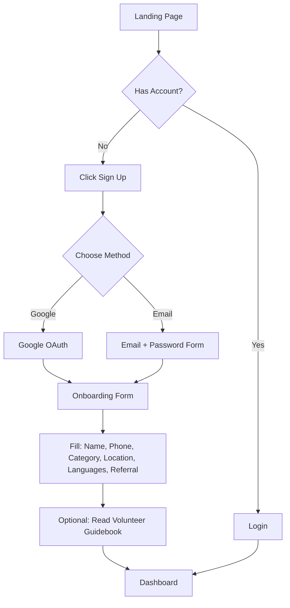
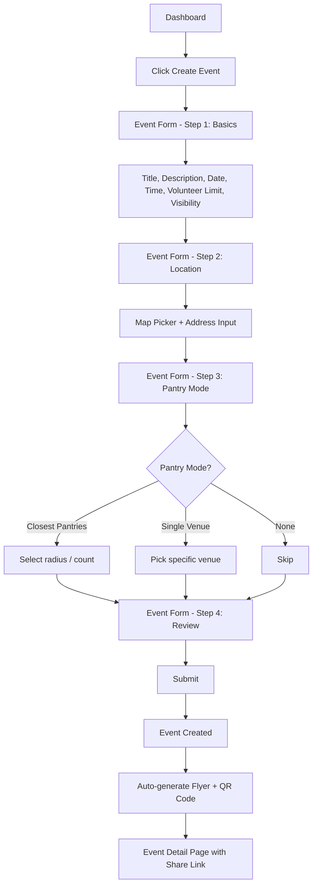
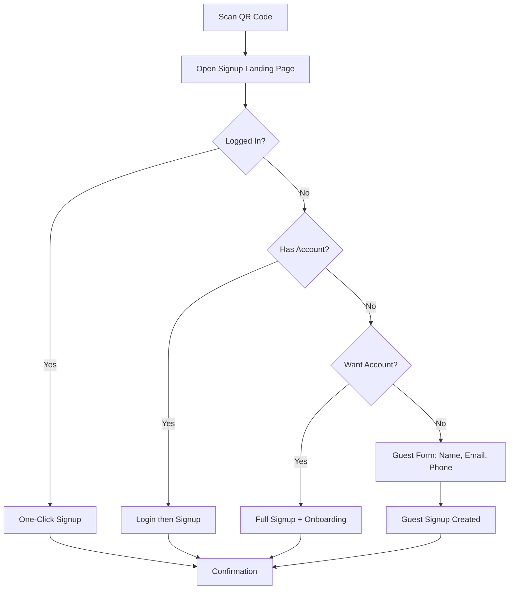
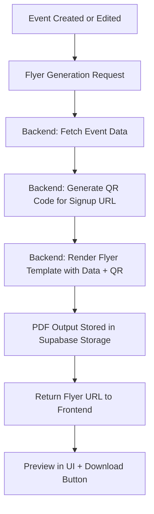
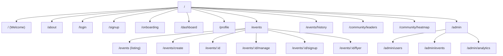
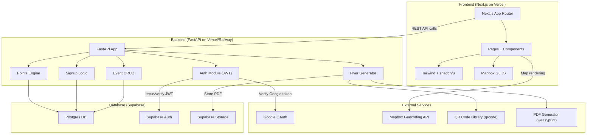

# Lemontree Volunteer Outreach Platform -- Build Plan

---

## 1. Product Summary

**Problem:** Lemontree is a nonprofit that relies on volunteers to flyer communities about local food pantries. Currently, every flyering event requires manual staff coordination -- scheduling, volunteer communication, flyer creation, and follow-up. This does not scale.

**Users:**

- **Event Leaders** -- volunteers who organize and run flyering events
- **Event Participants** -- volunteers who join events
- **Event Promoters** -- volunteers who share/promote events and recruit others
- **Lemontree Admins** -- staff with lightweight oversight and analytics

**Product Goal:** A self-serve platform where volunteers can create flyering events, auto-generate branded flyers with QR signup codes, recruit other volunteers, and track collective impact -- all with minimal Lemontree staff involvement.

**MVP vs Later-Phase Split:**


| Category             | MVP (Phases 0-5)                            | Later (Phases 6-7+)                  |
| -------------------- | ------------------------------------------- | ------------------------------------ |
| Auth + Onboarding    | Google OAuth, email/password, profile       | SSO, advanced referral tracking      |
| Event CRUD           | Full create/edit/delete, signup, share link | Mass messaging, team clustering      |
| Flyer Generation     | Template-based PDF with QR code             | Multi-template editor, drag-and-drop |
| Dashboard            | My events, upcoming, event history          | Advanced analytics                   |
| Points + Leaderboard | --                                          | Points system, leaderboard           |
| Heatmap              | --                                          | Geographic coverage heatmap          |
| Post-Event           | Basic photo upload                          | Automated appreciation, surveys      |


---

## 2. Assumptions and Open Questions

**Assumptions (labeled):**

- **[A1]** Google OAuth is the primary login; email/password is secondary. No phone-based OTP for MVP.
- **[A2]** Flyer generation produces a single branded PDF with event details and QR code. No multi-page or drag-and-drop editing for MVP.
- **[A3]** "Pantry mode" means the event targets food pantry locations. "xx closest pantries" uses geocoding from the user's event location. We will use a static dataset of pantry locations seeded into the DB.
- **[A4]** Guest signup (no account) captures name + email + phone only. Guests can later convert to full accounts.
- **[A5]** Points system is post-MVP. MVP tracks attendance only.
- **[A6]** Heatmap is post-MVP. MVP stores lat/lng on events which enables later heatmap derivation.
- **[A7]** SMS/email notifications are out of MVP scope; in-app messaging only for event leaders.
- **[A8]** Flyer branding uses a single fixed template for MVP. "Editing" means toggling colors/language, not layout changes.
- **[A9]** "Community Leaders" page is a public leaderboard of top event leaders by events organized / volunteers mobilized.

**Open Questions (need product owner input):**

- **[Q1]** What exactly does "Event Promoter" do differently from a Participant? Is it a formal role or just someone who shares the link? **Recommendation:** Treat Promoter as an optional tag on any user, not a separate role. Track referrals via share links.
- **[Q2]** Should private events be invite-only or password-protected? **Recommendation:** Invite-only via shareable link. Not listed publicly.
- **[Q3]** Is there a food pantry database we can seed, or do we need to integrate an external API? **Recommendation:** Seed a CSV of pantry locations. Add API integration later.
- **[Q4]** What flyer template(s) does Lemontree currently use? We need a reference design. **Recommendation:** Start with a clean single-template design and iterate.
- **[Q5]** Should the volunteer guidebook be in-app content or a downloadable PDF? **Recommendation:** Static in-app page for MVP, downloadable PDF later.
- **[Q6]** Is there a cap on events a single leader can create? **Recommendation:** No cap for MVP, add rate limiting if abused.

---

## 3. MVP Definition

### Must-Have (ship-blocking)

- Google OAuth + email/password signup/login
- Volunteer onboarding form (name, phone, email, role, category, location, languages, referral)
- Event creation with all specified fields (title, description, leader, date/time, location with map, volunteer limit, public/private, pantry mode, shareable link)
- Event listing (upcoming events, public feed)
- Event signup (authenticated + guest)
- QR code generation on event detail page (links to signup)
- Basic flyer generation (PDF with event info + QR code)
- Event detail page with signup list
- Dashboard (my events, events I joined)
- Profile page (view + edit)

### Should-Have (strongly desired)

- Event editing by leader
- Event history (past events)
- Post-event photo upload
- Map-based location picker (Mapbox)
- Shareable event link with OG meta tags
- Guest-to-account conversion flow
- Basic event lifecycle states (upcoming / active / completed)

### Nice-to-Have (defer if tight)

- Points system + leaderboard
- Heatmap
- Mass messaging
- Team clustering
- Automated post-event appreciation
- Badges / certifications
- Community Leaders page with rankings
- PWA support

---

## 4. User Roles and Permissions

```
Role              | Create Event | Edit Event  | Delete Event | View Events | Join Event | Manage Signups | View Dashboard | View All Events | Manage Users | Generate Flyer | Upload Photos
------------------|-------------|-------------|-------------|-------------|-----------|---------------|---------------|----------------|-------------|---------------|-------------
Event Leader      | Yes         | Own only    | Own only    | All public  | Yes       | Own events    | Own events    | Public         | No          | Own events    | Own events
Event Participant | No          | No          | No          | All public  | Yes       | No            | Joined events | Public         | No          | No            | Own attendance
Event Promoter*   | No          | No          | No          | All public  | Yes       | No            | Shared events | Public         | No          | No            | No
Admin             | Yes         | All         | All         | All         | Yes       | All           | All           | All            | Yes         | All           | All
```

*Promoter is an optional tag, not a separate auth role. Any user can share an event link. Referral tracking attributes signups to the sharer.

**Implementation:** Store `role` as an enum on the user: `volunteer | admin`. Track `is_event_leader` dynamically (any user who creates an event becomes leader of that event). Promoter tracking via `referral_code` on share links.

---

## 5. Core User Flows

### Flow 1: New Volunteer Onboarding




**Steps:**

1. User lands on welcome page, clicks "Get Started"
2. Chooses Google OAuth or email/password signup
3. After auth, redirected to onboarding form (multi-step or single page)
4. Fills in: name, phone, category, location, languages spoken, how they found Lemontree, referral code (optional)
5. Optional: views volunteer guidebook / conversation tips
6. Redirected to dashboard

### Flow 2: Event Creation




**Steps:**

1. Authenticated user clicks "Create Event" from dashboard
2. Multi-step form: Basics -> Location -> Pantry Mode -> Review
3. Location step uses Mapbox for geocoding + map pin
4. On submit: event created, shareable link generated, flyer auto-generated
5. User sees event detail page with flyer preview, QR code, share link

### Flow 3: Event Signup via QR Code




**Steps:**

1. Person scans QR code on flyer -> opens `/events/{event_id}/signup?ref={referral_code}`
2. If logged in: one-click signup, done
3. If not logged in: option to login, create account, or continue as guest
4. Guest flow: minimal form (name, email, phone), no password needed
5. Confirmation page with event details and "add to calendar" link

### Flow 4: Flyer Generation




**Steps:**

1. Triggered on event creation or when leader requests regeneration
2. Backend fetches event data, generates QR code (pointing to signup URL)
3. Renders HTML template -> PDF (using `weasyprint` or `reportlab`)
4. Stores PDF in Supabase Storage bucket
5. Returns URL; frontend shows preview + download

### Flow 5: Event Management by Leader

**Steps:**

1. Leader views event from dashboard -> event detail/management page
2. Sees: signup count, attendee list, event status
3. Can: edit event details, view/download flyer, copy share link
4. Pre-event: send message to all signups (in-app notification)
5. Post-event: mark attendance (attended / no-show), upload photos, trigger appreciation message
6. Event auto-transitions: upcoming -> active (on date) -> completed (after end time)

### Flow 6: Post-Event Wrap-Up

**Steps:**

1. After event end time, status transitions to "completed"
2. Leader can mark each signup as attended / no-show / cancelled
3. Leader uploads event photos (stored in Supabase Storage)
4. System sends appreciation notification to attendees (in-app for MVP)
5. Points awarded based on attendance (post-MVP)

### Flow 7: Points / Impact Tracking (Post-MVP)

**Steps:**

1. Points awarded for: creating event (+50), attending event (+20), referring volunteer (+30), uploading photos (+10)
2. Points stored in `point_transactions` table
3. User profile shows total points + breakdown
4. Leaderboard page shows top volunteers by points

### Flow 8: Heatmap (Post-MVP)

**Steps:**

1. Events with lat/lng stored in DB
2. Heatmap aggregation job groups events by geographic grid cells
3. Frontend renders heatmap layer on Mapbox map
4. Color intensity = event density. Sparse areas highlighted to motivate coverage.

---

## 6. Information Architecture

### Route Tree




### Public Routes (no auth required)

- `/` -- Welcome/landing page
- `/about` -- About Lemontree
- `/login` -- Login
- `/signup` -- Signup
- `/events/:id/signup` -- Event signup landing (QR code destination)
- `/community/leaders` -- Public leaderboard
- `/community/heatmap` -- Public heatmap

### Authenticated Routes

- `/onboarding` -- Post-signup onboarding form
- `/dashboard` -- Main dashboard
- `/profile` -- User profile (view + edit)
- `/events` -- Browse upcoming public events
- `/events/create` -- Create new event
- `/events/:id` -- Event detail
- `/events/:id/manage` -- Event management (leader only)
- `/events/:id/flyer` -- Flyer preview/edit (leader only)
- `/events/history` -- Past events

### Admin Routes

- `/admin` -- Admin dashboard
- `/admin/users` -- User management
- `/admin/events` -- All events oversight
- `/admin/analytics` -- Platform analytics

---

## 7. Detailed Page-by-Page Requirements

### 7.1 Welcome Page (`/`)

- **Purpose:** Convert visitors into volunteers
- **Primary Users:** New visitors, potential volunteers
- **UI Sections:**
  - Hero with tagline + CTA ("Get Started" / "Join as Volunteer")
  - Mission statement / what Lemontree does
  - How it works (3-step: Sign up -> Create/Join Event -> Make Impact)
  - Social proof (volunteer count, events hosted, areas covered)
  - Footer with links
- **Components:** Hero, StepCard, StatsBar, CTAButton
- **Data:** Aggregate stats (total volunteers, events, etc.) -- can be static for MVP
- **Actions:** Navigate to signup, navigate to about, browse events
- **Edge States:** None significant

### 7.2 About Page (`/about`)

- **Purpose:** Explain Lemontree's mission, include volunteer guidebook content
- **Primary Users:** Prospective volunteers
- **UI Sections:**
  - Mission and story
  - Volunteer guidebook (conversation tips, icebreakers)
  - Team / leadership
  - Contact info
- **Components:** ContentSection, AccordionFAQ, TeamGrid
- **Data:** Static content (MDX or hardcoded)
- **Actions:** Navigate to signup
- **Edge States:** None

### 7.3 Login / Signup (`/login`, `/signup`)

- **Purpose:** Authenticate users
- **Primary Users:** All
- **UI Sections:**
  - Google OAuth button (prominent)
  - Email + password form
  - Toggle between login/signup
  - "Forgot password" link
- **Components:** AuthForm, GoogleOAuthButton, InputField, PasswordField
- **Data:** None pre-loaded
- **Actions:** Login, signup, OAuth redirect, forgot password
- **Edge States:** Invalid credentials, email already exists, OAuth failure, network error

### 7.4 Onboarding (`/onboarding`)

- **Purpose:** Collect volunteer profile information after first signup
- **Primary Users:** New users
- **UI Sections:**
  - Progress indicator (step 1/2/3)
  - Step 1: Personal info (name, phone, category, location)
  - Step 2: Languages, referral, how they found Lemontree
  - Step 3: Welcome message + optional guidebook
- **Components:** MultiStepForm, LocationPicker, MultiSelect (languages), RadioGroup (category)
- **Data:** None pre-loaded
- **Actions:** Submit profile, skip optional fields, complete onboarding
- **Edge States:** Incomplete required fields, location service denied

### 7.5 Dashboard (`/dashboard`)

- **Purpose:** Central hub for volunteer activity
- **Primary Users:** All authenticated users
- **UI Sections:**
  - Welcome banner with user name + quick stats
  - "My Upcoming Events" (created + joined)
  - "Quick Actions" (Create Event, Browse Events, View Profile)
  - Recent activity feed (optional for MVP)
  - Impact summary (events attended, hours contributed) -- placeholder for MVP
- **Components:** EventCard, StatsWidget, QuickActionCard, ActivityFeed
- **Data:** User's events (created + signed up), user stats
- **Actions:** Create event, view event, browse events
- **Edge States:** No events yet (empty state with CTA), loading state

### 7.6 Profile (`/profile`)

- **Purpose:** View and edit personal information
- **Primary Users:** All authenticated users
- **UI Sections:**
  - Profile header (avatar, name, role, category)
  - Editable fields (all onboarding fields)
  - Stats summary (events created, attended, points)
  - Event history summary
- **Components:** ProfileHeader, EditableField, StatsGrid
- **Data:** User record, aggregated stats
- **Actions:** Edit profile, save changes
- **Edge States:** Save failure, unsaved changes warning

### 7.7 Upcoming Events (`/events`)

- **Purpose:** Browse and discover public events
- **Primary Users:** All authenticated users
- **UI Sections:**
  - Search bar + filters (date, location, category)
  - Map view toggle (show events on map)
  - Event cards grid/list
  - Pagination
- **Components:** EventCard, SearchBar, FilterPanel, MapView, Pagination
- **Data:** Public events list (paginated), user's signup status per event
- **Actions:** Search, filter, view event detail, signup
- **Edge States:** No events found, no events in area, loading

### 7.8 Event History (`/events/history`)

- **Purpose:** View past events the user participated in or led
- **Primary Users:** All authenticated users
- **UI Sections:**
  - Filter: "Events I Led" / "Events I Joined" / "All"
  - Event cards with completion status
  - Impact summary per event (volunteers attended, photos)
- **Components:** EventCard (past variant), FilterTabs, ImpactSummary
- **Data:** User's past events with attendance data
- **Actions:** View event detail, view photos
- **Edge States:** No past events

### 7.9 Event Creation (`/events/create`)

- **Purpose:** Create a new flyering event (PRIORITY #1 page)
- **Primary Users:** Event Leaders
- **UI Sections:**
  - Multi-step form with progress bar
  - Step 1 -- Basics: Title, description, date/time pickers, volunteer limit, public/private toggle
  - Step 2 -- Location: Mapbox map with pin drop, address autocomplete, location name
  - Step 3 -- Pantry Mode: Toggle (none / closest N pantries / specific venue), pantry search/select
  - Step 4 -- Review: Summary of all fields, flyer language selector, submit
- **Components:** MultiStepForm, DateTimePicker, MapboxLocationPicker, PantrySelector, VolunteerLimitInput, VisibilityToggle, ReviewSummary
- **Data:** Pantry locations (for pantry mode), Mapbox geocoding API
- **Actions:** Navigate steps, submit event, save draft (nice-to-have)
- **Edge States:** Validation errors per step, Mapbox API failure, duplicate event warning

### 7.10 Event Detail / Management (`/events/:id`, `/events/:id/manage`)

- **Purpose:** View event info (public), manage event (leader)
- **Primary Users:** All users (detail), Event Leaders (manage)
- **UI Sections (Detail):**
  - Event header (title, date, location, leader)
  - Map showing event location + nearby pantries
  - Description
  - Signup count / volunteer limit progress bar
  - Signup button (or "Already signed up" state)
  - Share link + QR code
  - Flyer download button
- **UI Sections (Manage -- leader only):**
  - All detail sections plus:
  - Attendee list with check-in status
  - Edit event button
  - Message volunteers button
  - Post-event: mark attendance, upload photos
  - Regenerate flyer button
- **Components:** EventHeader, MapEmbed, SignupButton, AttendeeList, CheckInToggle, PhotoUploader, MessageComposer
- **Data:** Event record, signups list, flyer URL, user's signup status
- **Actions:** Signup, cancel signup, edit event, message volunteers, mark attendance, upload photos, download flyer
- **Edge States:** Event full, event passed, event cancelled, not authorized to manage

### 7.11 Event Signup Landing (`/events/:id/signup`)

- **Purpose:** QR code destination for flyered people to sign up
- **Primary Users:** General public (scanned QR code)
- **UI Sections:**
  - Event summary (title, date, location, description)
  - Signup options: Login, Create Account, Continue as Guest
  - Guest form: Name, Email, Phone
  - Confirmation message after signup
- **Components:** EventSummaryCard, GuestSignupForm, AuthPrompt, ConfirmationMessage
- **Data:** Public event info
- **Actions:** Guest signup, login redirect, account creation redirect
- **Edge States:** Event full, event passed, invalid event ID, already signed up

### 7.12 Flyer Preview / Edit (`/events/:id/flyer`)

- **Purpose:** Preview and customize the auto-generated flyer
- **Primary Users:** Event Leaders
- **UI Sections:**
  - Flyer preview (rendered image/PDF preview)
  - Customization panel: language selector, color theme toggle (if applicable)
  - Download PDF button
  - Regenerate button
  - QR code display
- **Components:** FlyerPreview, LanguageSelector, ColorThemeToggle, DownloadButton
- **Data:** Event record, generated flyer URL
- **Actions:** Change language, regenerate flyer, download PDF
- **Edge States:** Flyer generation in progress (loading), generation failed

### 7.13 Community Leaders (`/community/leaders`)

- **Purpose:** Public leaderboard showcasing top volunteers
- **Primary Users:** All users (public)
- **UI Sections:**
  - Leaderboard table/cards (rank, name, events led, volunteers mobilized, points)
  - Time filter (all-time, this month, this week)
  - Category filter (by region, by category)
- **Components:** LeaderboardTable, LeaderCard, TimeFilter
- **Data:** Aggregated leaderboard data
- **Actions:** Filter, view leader profile
- **Edge States:** No data yet, loading

---

## 8. Data Model Design

### 8.1 `users`


| Column               | Type                                                               | Required | Notes                                     |
| -------------------- | ------------------------------------------------------------------ | -------- | ----------------------------------------- |
| id                   | UUID (PK)                                                          | Yes      | Default: `gen_random_uuid()`              |
| email                | VARCHAR(255)                                                       | Yes      | Unique, indexed                           |
| password_hash        | VARCHAR(255)                                                       | No       | Null for OAuth-only users                 |
| name                 | VARCHAR(255)                                                       | Yes      |                                           |
| phone                | VARCHAR(20)                                                        | No       |                                           |
| avatar_url           | TEXT                                                               | No       |                                           |
| role                 | ENUM('volunteer','admin')                                          | Yes      | Default: 'volunteer'                      |
| category             | ENUM('corporate','leadership_group','student','community','other') | No       |                                           |
| location_name        | VARCHAR(255)                                                       | No       | Human-readable location                   |
| latitude             | DECIMAL(10,8)                                                      | No       |                                           |
| longitude            | DECIMAL(11,8)                                                      | No       |                                           |
| languages            | TEXT[]                                                             | No       | Postgres array                            |
| referral_source      | VARCHAR(255)                                                       | No       | How they found Lemontree                  |
| referred_by_user_id  | UUID (FK -> users)                                                 | No       |                                           |
| referral_code        | VARCHAR(20)                                                        | Yes      | Unique, auto-generated for share tracking |
| onboarding_completed | BOOLEAN                                                            | Yes      | Default: false                            |
| total_points         | INTEGER                                                            | Yes      | Default: 0, denormalized for perf         |
| auth_provider        | ENUM('email','google')                                             | Yes      |                                           |
| created_at           | TIMESTAMPTZ                                                        | Yes      | Default: now()                            |
| updated_at           | TIMESTAMPTZ                                                        | Yes      | Auto-update trigger                       |


**Indexes:** `email` (unique), `referral_code` (unique), `location` (lat/lng for geo queries), `total_points` (for leaderboard)

### 8.2 `events`


| Column               | Type                                                      | Required | Notes                      |
| -------------------- | --------------------------------------------------------- | -------- | -------------------------- |
| id                   | UUID (PK)                                                 | Yes      |                            |
| title                | VARCHAR(255)                                              | Yes      |                            |
| description          | TEXT                                                      | No       |                            |
| event_leader_id      | UUID (FK -> users)                                        | Yes      | Indexed                    |
| visibility           | ENUM('public','private')                                  | Yes      | Default: 'public'          |
| status               | ENUM('draft','upcoming','active','completed','cancelled') | Yes      | Default: 'upcoming'        |
| date                 | DATE                                                      | Yes      | Indexed                    |
| start_time           | TIMESTAMPTZ                                               | Yes      |                            |
| end_time             | TIMESTAMPTZ                                               | Yes      |                            |
| location_name        | VARCHAR(255)                                              | Yes      |                            |
| latitude             | DECIMAL(10,8)                                             | Yes      |                            |
| longitude            | DECIMAL(11,8)                                             | Yes      |                            |
| volunteer_limit      | INTEGER                                                   | No       | Null = unlimited           |
| current_signup_count | INTEGER                                                   | Yes      | Default: 0, denormalized   |
| pantry_mode          | ENUM('none','closest_pantries','single_venue')            | Yes      | Default: 'none'            |
| pantry_count         | INTEGER                                                   | No       | For closest_pantries mode  |
| pantry_venue_id      | UUID (FK -> pantry_locations)                             | No       | For single_venue mode      |
| flyer_language       | VARCHAR(10)                                               | Yes      | Default: 'en'              |
| flyer_url            | TEXT                                                      | No       | URL to generated flyer PDF |
| shareable_link       | VARCHAR(255)                                              | Yes      | Unique short link or slug  |
| created_at           | TIMESTAMPTZ                                               | Yes      |                            |
| updated_at           | TIMESTAMPTZ                                               | Yes      |                            |


**Indexes:** `event_leader_id`, `date`, `status`, `(latitude, longitude)` (for geo queries), `shareable_link` (unique)

### 8.3 `event_signups`


| Column           | Type                                                | Required | Notes                         |
| ---------------- | --------------------------------------------------- | -------- | ----------------------------- |
| id               | UUID (PK)                                           | Yes      |                               |
| event_id         | UUID (FK -> events)                                 | Yes      |                               |
| user_id          | UUID (FK -> users)                                  | No       | Null for guest signups        |
| guest_signup_id  | UUID (FK -> guest_signups)                          | No       |                               |
| status           | ENUM('registered','attended','cancelled','no_show') | Yes      | Default: 'registered'         |
| referred_by_code | VARCHAR(20)                                         | No       | Referral code from share link |
| signed_up_at     | TIMESTAMPTZ                                         | Yes      |                               |
| checked_in_at    | TIMESTAMPTZ                                         | No       |                               |


**Indexes:** `(event_id, user_id)` unique, `(event_id, guest_signup_id)` unique, `event_id`
**Constraint:** Either `user_id` or `guest_signup_id` must be non-null (CHECK constraint)

### 8.4 `guest_signups`


| Column               | Type               | Required | Notes                          |
| -------------------- | ------------------ | -------- | ------------------------------ |
| id                   | UUID (PK)          | Yes      |                                |
| name                 | VARCHAR(255)       | Yes      |                                |
| email                | VARCHAR(255)       | Yes      |                                |
| phone                | VARCHAR(20)        | No       |                                |
| converted_to_user_id | UUID (FK -> users) | No       | Set when guest creates account |
| created_at           | TIMESTAMPTZ        | Yes      |                                |


**Indexes:** `email`, `converted_to_user_id`

### 8.5 `pantry_locations`


| Column     | Type          | Required | Notes         |
| ---------- | ------------- | -------- | ------------- |
| id         | UUID (PK)     | Yes      |               |
| name       | VARCHAR(255)  | Yes      |               |
| address    | TEXT          | Yes      |               |
| latitude   | DECIMAL(10,8) | Yes      |               |
| longitude  | DECIMAL(11,8) | Yes      |               |
| phone      | VARCHAR(20)   | No       |               |
| hours      | TEXT          | No       |               |
| is_active  | BOOLEAN       | Yes      | Default: true |
| created_at | TIMESTAMPTZ   | Yes      |               |


**Indexes:** `(latitude, longitude)` for geo queries

### 8.6 `point_transactions` (Post-MVP)


| Column      | Type                                                                                             | Required | Notes |
| ----------- | ------------------------------------------------------------------------------------------------ | -------- | ----- |
| id          | UUID (PK)                                                                                        | Yes      |       |
| user_id     | UUID (FK -> users)                                                                               | Yes      |       |
| event_id    | UUID (FK -> events)                                                                              | No       |       |
| action      | ENUM('event_created','event_attended','volunteer_referred','photo_uploaded','flyer_distributed') | Yes      |       |
| points      | INTEGER                                                                                          | Yes      |       |
| description | VARCHAR(255)                                                                                     | No       |       |
| created_at  | TIMESTAMPTZ                                                                                      | Yes      |       |


**Indexes:** `user_id`, `(user_id, created_at)` for history

### 8.7 `event_messages`


| Column       | Type                                           | Required | Notes |
| ------------ | ---------------------------------------------- | -------- | ----- |
| id           | UUID (PK)                                      | Yes      |       |
| event_id     | UUID (FK -> events)                            | Yes      |       |
| sender_id    | UUID (FK -> users)                             | Yes      |       |
| message_type | ENUM('announcement','reminder','appreciation') | Yes      |       |
| content      | TEXT                                           | Yes      |       |
| sent_at      | TIMESTAMPTZ                                    | Yes      |       |


**Indexes:** `event_id`

### 8.8 `event_photos`


| Column      | Type                | Required | Notes                |
| ----------- | ------------------- | -------- | -------------------- |
| id          | UUID (PK)           | Yes      |                      |
| event_id    | UUID (FK -> events) | Yes      |                      |
| uploaded_by | UUID (FK -> users)  | Yes      |                      |
| photo_url   | TEXT                | Yes      | Supabase Storage URL |
| caption     | VARCHAR(255)        | No       |                      |
| uploaded_at | TIMESTAMPTZ         | Yes      |                      |


**Indexes:** `event_id`

### 8.9 `flyer_generations`


| Column       | Type                | Required | Notes                 |
| ------------ | ------------------- | -------- | --------------------- |
| id           | UUID (PK)           | Yes      |                       |
| event_id     | UUID (FK -> events) | Yes      |                       |
| generated_by | UUID (FK -> users)  | Yes      |                       |
| template_id  | VARCHAR(50)         | Yes      | Template name/version |
| language     | VARCHAR(10)         | Yes      |                       |
| file_url     | TEXT                | Yes      |                       |
| generated_at | TIMESTAMPTZ         | Yes      |                       |


**Indexes:** `event_id`

### 8.10 `audit_logs`


| Column        | Type               | Required | Notes                                 |
| ------------- | ------------------ | -------- | ------------------------------------- |
| id            | UUID (PK)          | Yes      |                                       |
| user_id       | UUID (FK -> users) | No       |                                       |
| action        | VARCHAR(100)       | Yes      | e.g., 'event.created', 'user.updated' |
| resource_type | VARCHAR(50)        | Yes      | e.g., 'event', 'user'                 |
| resource_id   | UUID               | No       |                                       |
| metadata      | JSONB              | No       | Additional context                    |
| ip_address    | INET               | No       |                                       |
| created_at    | TIMESTAMPTZ        | Yes      |                                       |


**Indexes:** `user_id`, `action`, `created_at`

---

## 9. API Design

### Auth Endpoints


| Method | Route                       | Purpose        | Auth | Request                   | Response                              |
| ------ | --------------------------- | -------------- | ---- | ------------------------- | ------------------------------------- |
| POST   | `/api/auth/signup`          | Email signup   | No   | `{email, password, name}` | `{user, access_token, refresh_token}` |
| POST   | `/api/auth/login`           | Email login    | No   | `{email, password}`       | `{user, access_token, refresh_token}` |
| POST   | `/api/auth/google`          | Google OAuth   | No   | `{google_token}`          | `{user, access_token, refresh_token}` |
| POST   | `/api/auth/refresh`         | Refresh token  | No   | `{refresh_token}`         | `{access_token, refresh_token}`       |
| POST   | `/api/auth/logout`          | Logout         | Yes  | --                        | `{success}`                           |
| POST   | `/api/auth/forgot-password` | Password reset | No   | `{email}`                 | `{success}`                           |


### User Endpoints


| Method | Route                      | Purpose                   | Auth | Request                                            | Response                                         |
| ------ | -------------------------- | ------------------------- | ---- | -------------------------------------------------- | ------------------------------------------------ |
| GET    | `/api/users/me`            | Get current user          | Yes  | --                                                 | `{user}`                                         |
| PUT    | `/api/users/me`            | Update profile            | Yes  | `{name, phone, ...}`                               | `{user}`                                         |
| PUT    | `/api/users/me/onboarding` | Complete onboarding       | Yes  | `{category, location, languages, referral_source}` | `{user}`                                         |
| GET    | `/api/users/:id`           | Get user profile (public) | No   | --                                                 | `{user_public}`                                  |
| GET    | `/api/users/me/stats`      | Get user stats            | Yes  | --                                                 | `{events_created, events_attended, points, ...}` |


### Event Endpoints


| Method | Route                             | Purpose                 | Auth         | Request                                                                                                                                                              | Response                                         |
| ------ | --------------------------------- | ----------------------- | ------------ | -------------------------------------------------------------------------------------------------------------------------------------------------------------------- | ------------------------------------------------ |
| POST   | `/api/events`                     | Create event            | Yes          | `{title, description, date, start_time, end_time, location_name, lat, lng, volunteer_limit, visibility, pantry_mode, pantry_count, pantry_venue_id, flyer_language}` | `{event}`                                        |
| GET    | `/api/events`                     | List public events      | No           | Query: `?page, limit, date_from, date_to, lat, lng, radius, status`                                                                                                  | `{events[], total, page}`                        |
| GET    | `/api/events/:id`                 | Get event detail        | No*          | --                                                                                                                                                                   | `{event, signup_count, is_signed_up, flyer_url}` |
| PUT    | `/api/events/:id`                 | Update event            | Yes (leader) | `{...fields}`                                                                                                                                                        | `{event}`                                        |
| DELETE | `/api/events/:id`                 | Cancel/delete event     | Yes (leader) | --                                                                                                                                                                   | `{success}`                                      |
| GET    | `/api/events/my/created`          | My created events       | Yes          | Query: `?status`                                                                                                                                                     | `{events[]}`                                     |
| GET    | `/api/events/my/joined`           | My joined events        | Yes          | Query: `?status`                                                                                                                                                     | `{events[]}`                                     |
| GET    | `/api/events/:id/nearby-pantries` | Get pantries near event | No           | Query: `?count`                                                                                                                                                      | `{pantries[]}`                                   |


*Private events require auth + signup or leader status

### Signup Endpoints


| Method | Route                                | Purpose                          | Auth         | Request                                | Response         |
| ------ | ------------------------------------ | -------------------------------- | ------------ | -------------------------------------- | ---------------- |
| POST   | `/api/events/:id/signup`             | Signup for event (authenticated) | Yes          | `{referral_code?}`                     | `{signup}`       |
| POST   | `/api/events/:id/guest-signup`       | Guest signup                     | No           | `{name, email, phone, referral_code?}` | `{guest_signup}` |
| DELETE | `/api/events/:id/signup`             | Cancel signup                    | Yes          | --                                     | `{success}`      |
| GET    | `/api/events/:id/signups`            | List signups (leader)            | Yes (leader) | --                                     | `{signups[]}`    |
| PUT    | `/api/events/:id/signups/:signup_id` | Update attendance                | Yes (leader) | `{status}`                             | `{signup}`       |


### Flyer Endpoints


| Method | Route                            | Purpose                   | Auth         | Request                     | Response                    |
| ------ | -------------------------------- | ------------------------- | ------------ | --------------------------- | --------------------------- |
| POST   | `/api/events/:id/flyer/generate` | Generate/regenerate flyer | Yes (leader) | `{language?, template_id?}` | `{flyer_url}`               |
| GET    | `/api/events/:id/flyer`          | Get flyer info            | No           | --                          | `{flyer_url, generated_at}` |


### Messaging Endpoints


| Method | Route                      | Purpose                    | Auth         | Request                   | Response       |
| ------ | -------------------------- | -------------------------- | ------------ | ------------------------- | -------------- |
| POST   | `/api/events/:id/messages` | Send message to volunteers | Yes (leader) | `{content, message_type}` | `{message}`    |
| GET    | `/api/events/:id/messages` | Get event messages         | Yes (member) | --                        | `{messages[]}` |


### Photo Endpoints


| Method | Route                    | Purpose          | Auth | Request                      | Response     |
| ------ | ------------------------ | ---------------- | ---- | ---------------------------- | ------------ |
| POST   | `/api/events/:id/photos` | Upload photo     | Yes  | multipart: `{file, caption}` | `{photo}`    |
| GET    | `/api/events/:id/photos` | Get event photos | No   | --                           | `{photos[]}` |


### Points + Leaderboard Endpoints (Post-MVP)


| Method | Route              | Purpose         | Auth | Request                           | Response                  |
| ------ | ------------------ | --------------- | ---- | --------------------------------- | ------------------------- |
| GET    | `/api/points/me`   | Get my points   | Yes  | --                                | `{total, transactions[]}` |
| GET    | `/api/leaderboard` | Get leaderboard | No   | Query: `?period, category, limit` | `{leaders[]}`             |


### Heatmap Endpoints (Post-MVP)


| Method | Route          | Purpose                | Auth | Request                      | Response                                |
| ------ | -------------- | ---------------------- | ---- | ---------------------------- | --------------------------------------- |
| GET    | `/api/heatmap` | Get event density data | No   | Query: `?bounds, zoom_level` | `{cells[{lat, lng, count, intensity}]}` |


### Admin Endpoints


| Method | Route                       | Purpose            | Auth        | Request                | Response                           |
| ------ | --------------------------- | ------------------ | ----------- | ---------------------- | ---------------------------------- |
| GET    | `/api/admin/users`          | List all users     | Yes (admin) | Query: `?page, search` | `{users[], total}`                 |
| PUT    | `/api/admin/users/:id/role` | Change user role   | Yes (admin) | `{role}`               | `{user}`                           |
| GET    | `/api/admin/events`         | List all events    | Yes (admin) | Query: `?page, status` | `{events[], total}`                |
| GET    | `/api/admin/analytics`      | Platform analytics | Yes (admin) | --                     | `{total_users, total_events, ...}` |
| DELETE | `/api/admin/events/:id`     | Force delete event | Yes (admin) | --                     | `{success}`                        |


---

## 10. System Architecture




### Component Responsibilities

**Frontend (Next.js):**

- Server-side rendering for public pages (SEO for events, landing)
- Client-side interactivity for forms, maps, dashboards
- JWT token management (httpOnly cookies or localStorage)
- Mapbox GL JS for map rendering
- PDF preview via iframe/embed

**Backend (FastAPI):**

- REST API for all business logic
- JWT-based authentication (issue + verify tokens)
- Google OAuth token verification
- Event CRUD with authorization checks
- Flyer generation pipeline (HTML template -> QR inject -> PDF render)
- File upload handling -> Supabase Storage
- Points calculation and attribution
- Heatmap data aggregation

**Database (Supabase Postgres):**

- All relational data storage
- Row Level Security (RLS) as defense-in-depth (primary auth in FastAPI)
- Supabase Auth for Google OAuth provider management
- Supabase Storage for flyers and photos

### Key Flows

**Auth Flow:**

1. User clicks "Sign in with Google" -> frontend gets Google token
2. Frontend sends Google token to `POST /api/auth/google`
3. Backend verifies with Google, creates/finds user, issues JWT
4. JWT stored in httpOnly cookie, sent with every API request

**Flyer Generation Flow:**

1. Event created -> backend auto-triggers flyer generation
2. Backend renders HTML flyer template with event data
3. QR code generated pointing to `{domain}/events/{id}/signup`
4. HTML rendered to PDF via weasyprint
5. PDF uploaded to Supabase Storage
6. URL saved to `events.flyer_url`

**QR / Share Link Flow:**

1. QR code encodes `{domain}/events/{id}/signup?ref={referral_code}`
2. Scanning opens public signup landing page
3. Page shows event info + signup options (login / guest)
4. Guest signup creates `guest_signups` record + `event_signups` record
5. Referral code tracked for points attribution

**Post-Event Photo Flow:**

1. Leader or attendee uploads photo via event management page
2. Frontend sends multipart form to `POST /api/events/:id/photos`
3. Backend validates auth + event membership
4. File uploaded to Supabase Storage bucket `event-photos/{event_id}/`
5. Record created in `event_photos` table

### Third-Party Integrations


| Service                 | Purpose             | Free Tier         | Notes                        |
| ----------------------- | ------------------- | ----------------- | ---------------------------- |
| Supabase                | DB + Auth + Storage | Yes (generous)    | Primary infrastructure       |
| Mapbox                  | Maps + Geocoding    | 50k loads/mo free | Location picker + event maps |
| Google OAuth            | Authentication      | Free              | Primary login method         |
| qrcode (Python lib)     | QR code generation  | Free (OSS)        | No external API needed       |
| weasyprint (Python lib) | HTML-to-PDF         | Free (OSS)        | Flyer PDF generation         |
| Vercel                  | Frontend hosting    | Free tier         | Next.js deployment           |
| Railway/Render          | Backend hosting     | Free tier         | FastAPI deployment           |


---

## 11. Technical Decisions and Tradeoffs

### Supabase Postgres vs MongoDB

**Decision: Supabase Postgres**

- Volunteer/event data is highly relational (users -> events -> signups -> messages)
- Need JOIN-heavy queries (event with signup count, user with events led/joined)
- Supabase provides auth, storage, and realtime out of the box
- Postgres supports array types (for `languages`), JSONB (for flexible metadata), and PostGIS (for geo queries)
- MongoDB would require more manual relationship management and no built-in auth/storage

### Auth: Supabase Auth vs Custom FastAPI

**Decision: Hybrid -- Supabase Auth for OAuth providers, FastAPI for JWT issuance**

- Use Supabase Auth as the OAuth provider manager (Google sign-in)
- FastAPI issues and verifies its own JWTs for API authentication
- This gives full control over token claims, role-based access, and custom auth logic
- Supabase Auth handles the complexity of OAuth flows and token refresh with providers

### Flyer Generation: Sync vs Async

**Decision: Synchronous for MVP, with async upgrade path**

- MVP: Generate flyer synchronously on event creation. weasyprint renders a simple template in <2 seconds.
- If generation becomes slow (complex templates, high volume): move to background task with Celery/ARQ + Redis
- Frontend shows loading state during generation, falls back to "generating..." placeholder

### Guest Signups

**Decision: Separate `guest_signups` table linked via `event_signups`**

- Guests get a record in `guest_signups` (name, email, phone only)
- Their `event_signups` record references `guest_signup_id` instead of `user_id`
- When a guest later creates an account with the same email, run a migration to:
  - Set `guest_signups.converted_to_user_id`
  - Update matching `event_signups` to point to the new `user_id`
- This keeps the user table clean and allows frictionless event signup

### Points + Leaderboard: Live vs Pre-Aggregated

**Decision: Pre-aggregated `total_points` on user + transaction log**

- `users.total_points` is denormalized for fast leaderboard queries (`ORDER BY total_points DESC LIMIT 20`)
- `point_transactions` table stores the full log for audit/breakdown
- On point award: INSERT into `point_transactions` + UPDATE `users.total_points` in a transaction
- This avoids expensive `SUM()` queries on every leaderboard load

### Heatmap: Live vs Denormalized

**Decision: Derive from events table for MVP, denormalize later if needed**

- MVP: Query `SELECT latitude, longitude, COUNT(*) FROM events WHERE status='completed' GROUP BY grid_cell` 
- Use server-side grid bucketing (round lat/lng to N decimal places)
- If performance becomes an issue: add `heatmap_aggregates` table refreshed by cron/trigger
- Mapbox GL JS heatmap layer can handle ~10k points client-side

---

## 12. Implementation Roadmap

### Phase 0: Setup / Scaffolding (Day 1 morning)

**Objective:** Project skeleton with all tooling ready
**Deliverables:**

- Next.js app with TypeScript + Tailwind + shadcn/ui initialized
- FastAPI project with folder structure, CORS, health check
- Supabase project created (DB, Auth, Storage buckets)
- GitHub repo with monorepo structure (`/frontend`, `/backend`)
- Environment variables configured
- Basic CI (lint + type check)

**Tasks:**

1. `npx create-next-app` with TypeScript + Tailwind + App Router
2. Install shadcn/ui, configure theme
3. `pip install fastapi uvicorn sqlalchemy alembic` + project structure
4. Create Supabase project, get connection strings
5. Set up Alembic migrations
6. Create GitHub repo, push skeleton
7. Configure `.env` files for both projects

**Dependencies:** None
**Risks:** Supabase project creation delay; Mapbox API key procurement

### Phase 1: Auth + Onboarding (Day 1 afternoon)

**Objective:** Users can sign up, log in, and complete onboarding
**Deliverables:**

- Google OAuth login working end-to-end
- Email/password signup + login
- JWT-based API authentication
- Onboarding form (multi-step)
- User profile page

**Tasks:**

1. Create `users` table migration
2. Implement `/api/auth/signup`, `/api/auth/login`, `/api/auth/google`
3. Implement JWT middleware for FastAPI
4. Build login/signup pages in Next.js
5. Integrate Google OAuth (Supabase Auth or direct)
6. Build onboarding form (multi-step with validation)
7. Build profile page (view + edit)
8. Implement `/api/users/me` endpoints

**Dependencies:** Phase 0
**Risks:** Google OAuth configuration complexity; token refresh edge cases

### Phase 2: Event Creation (Day 1 evening - Day 2 morning) -- PRIORITY

**Objective:** Users can create events with full details including map location
**Deliverables:**

- Event creation multi-step form
- Mapbox location picker integration
- Pantry mode selection
- Event stored in DB with all fields
- Shareable link generated

**Tasks:**

1. Create `events` and `pantry_locations` table migrations
2. Seed pantry locations data
3. Implement `/api/events` CRUD endpoints
4. Build event creation form (4-step)
5. Integrate Mapbox GL JS for location picker
6. Implement pantry mode logic (nearest N or specific venue)
7. Generate shareable link on event creation
8. Build event detail page

**Dependencies:** Phase 1 (auth)
**Risks:** Mapbox integration complexity; pantry data sourcing

### Phase 3: Event Signup + Share Flow (Day 2 midday)

**Objective:** People can sign up for events via shared links and QR codes
**Deliverables:**

- Authenticated event signup
- Guest signup flow
- QR code generation
- Event signup landing page
- Signup management for leaders

**Tasks:**

1. Create `event_signups` and `guest_signups` table migrations
2. Implement signup endpoints (authenticated + guest)
3. Build event signup landing page (`/events/:id/signup`)
4. Implement QR code generation (Python `qrcode` library)
5. Build signup list view for event leaders
6. Implement signup cancellation
7. Add referral code tracking

**Dependencies:** Phase 2 (events exist)
**Risks:** Guest-to-account conversion complexity

### Phase 4: Flyer Generation (Day 2 afternoon)

**Objective:** Auto-generate branded PDF flyers with event info and QR code
**Deliverables:**

- HTML flyer template
- PDF generation pipeline
- Flyer stored in Supabase Storage
- Flyer preview + download in UI
- Regeneration on event edit

**Tasks:**

1. Design HTML flyer template (Lemontree branding)
2. Implement flyer generation service (HTML -> inject data -> PDF)
3. Integrate QR code into flyer
4. Set up Supabase Storage bucket for flyers
5. Implement `/api/events/:id/flyer/generate` endpoint
6. Build flyer preview page
7. Wire auto-generation on event creation
8. Add regeneration trigger on event edit

**Dependencies:** Phase 3 (QR codes, signup URLs)
**Risks:** weasyprint installation on hosting platform; PDF rendering fidelity

### Phase 5: Dashboard + Event Management (Day 2 evening)

**Objective:** Central dashboard and event lifecycle management
**Deliverables:**

- Main dashboard with "my events" and "joined events"
- Event listing page (browse public events)
- Event management page (leader tools)
- Event history page
- Post-event: attendance marking, photo upload
- Basic messaging

**Tasks:**

1. Create `event_messages` and `event_photos` table migrations
2. Implement dashboard API endpoints
3. Build dashboard page with event cards
4. Build event listing page with filters
5. Build event management page (leader view)
6. Implement attendance marking
7. Implement photo upload (Supabase Storage)
8. Build event history page
9. Implement basic event messaging

**Dependencies:** Phase 3, Phase 4
**Risks:** Dashboard data aggregation performance

### Phase 6: Points + Leaderboard (Day 3 morning -- if time permits)

**Objective:** Gamification to drive engagement
**Deliverables:**

- Points awarded for key actions
- Points display on profile
- Community leaderboard page

**Tasks:**

1. Create `point_transactions` table migration
2. Implement points service (award on event create, attend, refer, upload)
3. Implement leaderboard endpoint
4. Build leaderboard page
5. Add points display to profile and dashboard

**Dependencies:** Phase 5
**Risks:** Can be simplified to just "events led / attended" counts without full points system

### Phase 7: Heatmap + Polish (Day 3 afternoon -- if time permits)

**Objective:** Geographic visualization and final polish
**Deliverables:**

- Event density heatmap on Mapbox
- Welcome/about pages polished
- Responsive design pass
- Error handling + loading states

**Tasks:**

1. Implement heatmap aggregation endpoint
2. Build heatmap page with Mapbox GL heatmap layer
3. Polish welcome and about pages
4. Add loading skeletons to all pages
5. Add error boundaries and toast notifications
6. Responsive design pass
7. Final bug sweep

**Dependencies:** Phase 5
**Risks:** Time pressure; heatmap can be cut entirely

---

## 13. Database + Backend First Implementation Checklist

### Schema Creation Order

1. `users` (no FK dependencies)
2. `pantry_locations` (no FK dependencies)
3. `events` (FK: users, pantry_locations)
4. `event_signups` (FK: events, users)
5. `guest_signups` (no FK dependencies)
6. Update `event_signups` to add FK to `guest_signups`
7. `event_messages` (FK: events, users)
8. `event_photos` (FK: events, users)
9. `flyer_generations` (FK: events, users)
10. `point_transactions` (FK: users, events)
11. `audit_logs` (FK: users)

### Migration Order

- Migration 001: Create `users` table + indexes
- Migration 002: Create `pantry_locations` table + seed data
- Migration 003: Create `events` table + indexes
- Migration 004: Create `guest_signups` table
- Migration 005: Create `event_signups` table with CHECK constraint
- Migration 006: Create `event_messages` table
- Migration 007: Create `event_photos` table
- Migration 008: Create `flyer_generations` table
- Migration 009: Create `point_transactions` table
- Migration 010: Create `audit_logs` table

### API Implementation Order

1. Health check (`GET /api/health`)
2. Auth endpoints (signup, login, google, refresh)
3. JWT middleware
4. User CRUD (`/api/users/me`)
5. Onboarding endpoint
6. Event CRUD (create, read, list, update, delete)
7. Event signup (authenticated)
8. Guest signup
9. Signup management (list, update attendance)
10. Flyer generation
11. Photo upload
12. Event messaging
13. Dashboard aggregation endpoints
14. Points + leaderboard (post-MVP)
15. Heatmap (post-MVP)
16. Admin endpoints

### Seed Data Ideas

- 5 test users (1 admin, 2 leaders, 2 participants)
- 50-100 pantry locations (source from USDA Food Pantry data or mock)
- 10 sample events (mix of upcoming, active, completed)
- 20-30 event signups across events
- Sample flyer template HTML

### Key Test Cases

- Auth: signup creates user, login returns JWT, expired JWT rejected, Google OAuth flow
- Events: create event validates required fields, private event not in public listing, event leader can edit, non-leader cannot edit
- Signups: signup increments count, signup at limit rejected, cancel decrements count, guest signup works without auth
- Flyers: generation produces valid PDF, QR code encodes correct URL, regeneration updates URL
- Permissions: non-leader cannot manage event, admin can manage any event, guest cannot access authenticated endpoints

---

## 14. Frontend Implementation Checklist

### App Shell

- Next.js App Router layout with header/nav/footer
- Navigation: logo, links (Dashboard, Events, Profile, Login/Signup)
- Auth context provider (JWT state, user info)
- Protected route wrapper component
- Toast notification system (shadcn/ui Toaster)
- Loading skeleton components
- Error boundary component

### Auth Screens

- Login page with Google OAuth button + email form
- Signup page with Google OAuth button + email form
- Forgot password page
- Auth form validation (zod + react-hook-form)
- Token storage and refresh logic
- Redirect after login (to dashboard or intended page)

### Onboarding

- Multi-step form component (progress bar, next/back)
- Step 1: Name, phone, category (radio group)
- Step 2: Location (with Mapbox autocomplete), languages (multi-select), referral
- Step 3: Welcome message + guidebook preview
- Form validation per step
- Submit handler -> API call

### Event Form (`/events/create`)

- Multi-step form (4 steps)
- Step 1: Title, description (textarea), date picker, time pickers (start/end), volunteer limit (number input), visibility toggle
- Step 2: Mapbox map with pin drop, address autocomplete, location name input
- Step 3: Pantry mode selector (none/closest/single), pantry count input, pantry venue search
- Step 4: Review summary, flyer language selector, submit button
- Form state management (react-hook-form + zod)
- Loading state on submit
- Success redirect to event detail

### Event Card Component

- Compact card for listings (title, date, location, signup count, leader)
- Status badge (upcoming/active/completed)
- Public/private indicator
- "Sign Up" quick action button
- Responsive layout (grid/list toggle)

### Event Detail Page

- Event header (title, date/time, location, leader info)
- Mapbox map embed with event pin + nearby pantries
- Description section
- Signup progress bar (current / limit)
- Signup button (or status: "Signed Up", "Event Full", "Event Passed")
- Share section (copy link button, QR code display)
- Flyer download button
- Photos gallery (if post-event)

### Event Management Page (Leader)

- All detail page sections plus:
- Attendee list table (name, email, status, check-in toggle)
- Edit event button -> opens edit form (same as create, pre-filled)
- Message composer (textarea + send button)
- Post-event: bulk attendance marking
- Photo uploader (drag-and-drop with previews)
- Regenerate flyer button

### Signup Landing Page (`/events/:id/signup`)

- Event summary card (public info)
- Three-option auth: Login, Sign Up, Continue as Guest
- Guest form: name, email, phone
- Confirmation state after signup
- "Add to Calendar" button (generate .ics)
- Handle: event full, event passed, already signed up

### Flyer Preview UI

- PDF viewer/embed for flyer preview
- Language selector dropdown
- Color theme toggle (if applicable)
- Download PDF button
- Regenerate button with loading state
- QR code display (separate from flyer)

### Dashboard Widgets

- Welcome banner with user name
- Quick stats cards (events created, events joined, hours)
- "My Upcoming Events" horizontal scroll or grid
- "Events I Joined" section
- Quick action buttons (Create Event, Browse Events)
- Empty state with CTA for new users

### Leaderboard Components (Post-MVP)

- Leaderboard table/card list
- Rank number, avatar, name, key metric
- Time period filter (week/month/all-time)
- Category filter
- Highlight current user's rank

### Map/Heatmap Components (Post-MVP)

- Mapbox GL JS heatmap layer
- Color gradient legend
- Zoom controls
- Tooltip on hover (area name, event count)
- Toggle overlay: events vs coverage gaps

---

## 15. Acceptance Criteria

### Onboarding

- New user can sign up and is redirected to onboarding form
- All required fields (name, email) are validated
- Optional fields can be skipped
- After onboarding, user lands on dashboard
- Profile shows all submitted onboarding data

### Auth

- Google OAuth login creates account on first use, logs in on subsequent
- Email/password signup with validation (min 8 chars, valid email)
- Login with wrong credentials shows clear error
- JWT expires after 1 hour; refresh token extends session
- Logout clears session and redirects to login

### Event Creation

- Event form validates all required fields before submission
- Map location picker sets lat/lng accurately
- Pantry mode "closest N" shows relevant nearby pantries
- Created event appears in "My Events" on dashboard
- Public event appears in public event listing
- Private event does NOT appear in public listing
- Shareable link is generated and functional

### Event Edit

- Only event leader can edit event
- All fields are editable
- Editing triggers flyer regeneration prompt
- Changes reflected immediately on event detail page

### Signup (Authenticated)

- User can sign up for an event with one click
- Signup count increments
- User cannot sign up twice for the same event
- User can cancel signup; count decrements
- Cannot sign up if event is at volunteer limit
- Cannot sign up for past events

### Guest Signup

- Guest can sign up with name + email + phone
- Guest signup is recorded and visible to event leader
- Guest receives confirmation on the signup page
- If guest later creates account with same email, signups are linked

### Flyer Generation

- Flyer is auto-generated when event is created
- Flyer contains: event title, date, time, location, QR code, Lemontree branding
- QR code on flyer links to correct signup page
- Flyer can be downloaded as PDF
- Flyer regenerates when event details change

### Dashboard

- Shows events user created
- Shows events user joined
- Shows basic stats (events count)
- New user sees empty state with "Create Event" CTA
- Loading state shown while data fetches

### Points (Post-MVP)

- Points awarded for: creating event, attending, referring, uploading photo
- Points total shown on profile
- Points history viewable

### Leaderboard (Post-MVP)

- Shows top N volunteers by points
- Filterable by time period
- Current user's rank highlighted

### Heatmap (Post-MVP)

- Map shows color-coded event density
- Darker areas = more events
- Sparse areas clearly visible
- Hovering shows event count for area

---

## 16. Risks / Hackathon Simplifications

### Simplify for MVP

- **Flyer template:** Use a single hardcoded HTML template. No drag-and-drop editor.
- **Pantry mode:** Seed 20-30 pantries in one city. Skip external API integration.
- **Email/SMS notifications:** Skip entirely. All communication is in-app or via shared links.
- **Team clustering:** Defer. Not needed for a working demo.
- **Points system:** Replace with simple counts (events created, events attended) on the profile.
- **Guest-to-account conversion:** Defer the automatic migration. Just track guest signups separately.

### What to Fake/Mock

- **Pantry data:** Seed a CSV of real pantry locations for the demo area.
- **Email sending:** Log to console instead of actually sending emails.
- **Volunteer guidebook:** Static hardcoded content, not a CMS.
- **Event lifecycle auto-transition:** Manual status change by leader instead of cron job.
- **Analytics:** Hardcode a few stats on the admin dashboard.

### Features to Defer if Time Tight (in order of what to cut)

1. Heatmap (cut first -- impressive but not core)
2. Points + leaderboard (cut second -- engagement feature, not core flow)
3. Post-event photo upload (cut third -- nice but not essential)
4. Event messaging (cut fourth -- leaders can use external channels)
5. Admin panel (cut fifth -- not needed for demo)
6. Event history page (cut sixth -- focus on upcoming)

### What Would Impress Judges Most

1. **Polished event creation flow** with map picker -- this is the hero feature
2. **Working flyer generation** with QR code that actually scans and signs someone up
3. **End-to-end demo:** Create event -> generate flyer -> scan QR -> guest signs up -> leader sees signup
4. **Clean, branded UI** that looks like a real product
5. **Heatmap** (if time permits) -- visual wow factor

---

## 17. Final Recommendation

### Recommended MVP Scope

Build Phases 0-4 completely (auth, onboarding, event creation, signup, flyer generation) plus a minimal dashboard (Phase 5 partial). This gives a complete end-to-end flow that demonstrates the core product value.

### Recommended Demo Flow (3-5 minutes)

1. **[30s]** Show landing page, explain the problem
2. **[30s]** Sign up with Google, complete onboarding
3. **[60s]** Create an event with map location, pantry mode, details
4. **[30s]** Show auto-generated flyer with QR code, download PDF
5. **[30s]** Open phone, scan QR code on the flyer
6. **[30s]** Guest signs up without an account on phone
7. **[30s]** Switch back to leader view -- show new signup appeared
8. **[30s]** Show dashboard with event stats, browse public events
9. **[if time]** Show heatmap or leaderboard

### Recommended Team Split (3-4 person team)

- **Person 1 (Backend Lead):** FastAPI setup, auth, database migrations, all API endpoints
- **Person 2 (Frontend Lead):** Next.js setup, auth pages, dashboard, event listing, profiles
- **Person 3 (Event + Flyer):** Event creation form, Mapbox integration, flyer generation, QR codes
- **Person 4 (Polish + Extras):** Landing page, about page, responsive design, heatmap, leaderboard (or split between Person 2/3 if 3-person team)

### Recommended Next Immediate Step Before Coding

1. **Create the GitHub repo** with monorepo structure (`/frontend`, `/backend`, `/docs`)
2. **Set up Supabase project** and save credentials
3. **Get Mapbox API key** and save to environment
4. **Get Google OAuth client ID** from Google Cloud Console
5. **Initialize both projects** with all dependencies
6. **Write the first migration** (users table) and run it
7. **Start building auth** -- it unblocks everything else

---

## Build Order Summary

```
Step  | Task                                              | Depends On
------|---------------------------------------------------|----------
  1   | Create GitHub repo, monorepo structure             | --
  2   | Initialize Next.js + Tailwind + shadcn/ui          | 1
  3   | Initialize FastAPI + SQLAlchemy + Alembic           | 1
  4   | Create Supabase project, configure env vars         | 1
  5   | Run migrations 001-005 (users through event_signups)| 3, 4
  6   | Implement auth API (signup, login, Google OAuth)     | 5
  7   | Build login + signup pages                           | 2, 6
  8   | Implement JWT middleware + /users/me                  | 6
  9   | Build onboarding form + profile page                  | 7, 8
 10   | Implement event CRUD API                              | 8
 11   | Seed pantry locations                                  | 5
 12   | Build event creation form (4-step with Mapbox)         | 9, 10, 11
 13   | Build event detail page                                | 12
 14   | Implement event signup API (auth + guest)              | 10
 15   | Build event signup landing page                        | 13, 14
 16   | Implement QR code generation                           | 14
 17   | Implement flyer generation (HTML -> PDF)               | 16
 18   | Build flyer preview / download page                    | 17
 19   | Run migrations 006-008 (messages, photos, flyers)      | 5
 20   | Build dashboard page                                   | 10, 14
 21   | Build event listing page with filters                  | 10
 22   | Build event management page (leader tools)             | 13, 14, 19
 23   | Implement photo upload                                 | 19
 24   | Build event history page                               | 10
 25   | Polish: landing page, about page, responsive           | 2
 26   | [If time] Points + leaderboard                         | 14, 22
 27   | [If time] Heatmap                                      | 10
 28   | Final testing, bug fixes, demo prep                    | All
```

